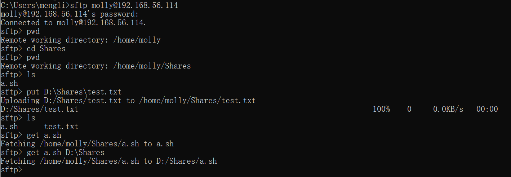
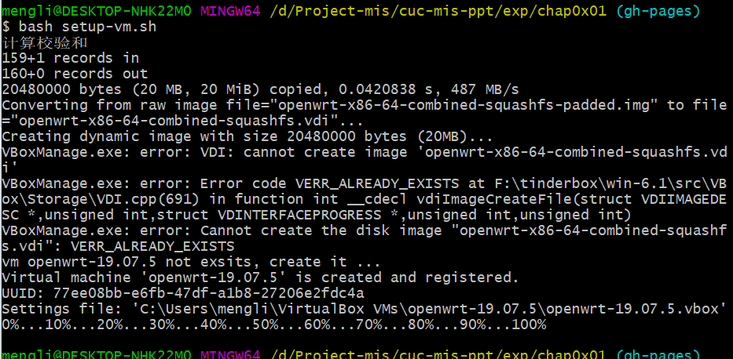
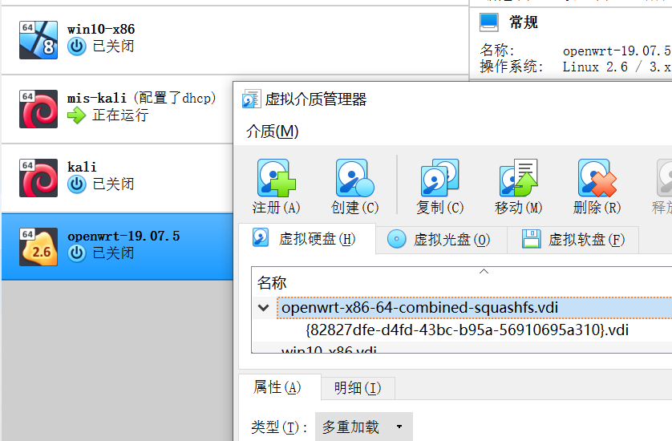
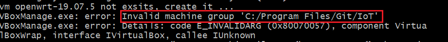

# H1 OpenWrt 虚拟机搭建

**目录**

* [实验目的](#10)
* [实验环境](#00)
* [实验要求](#01)
* [实验过程](#02)
  * [020](020)
  * [021](#021)
  * [022](#022)
  * [023](#023)
  * [024](#024)
  * [025](#025)
  * [026](#026)
* [实验总结](#03)
* [问题和解决](#04)
* [课后作业](#05)
* [参考资料](#06)

## 实验目的

- 熟悉基于 OpenWrt 的无线接入点（AP）配置
- 为第二章、第三章和第四章实验准备好「无线软 AP」环境

## 实验环境

- 可以开启监听模式、AP 模式和数据帧注入功能的 USB 无线网卡
- Virtualbox 6.1.18
- Kali 2020.3

## 实验要求

- [ ] 对照 [第一章 实验](https://c4pr1c3.github.io/cuc-mis/chap0x01/exp.html) `无线路由器/无线接入点（AP）配置` 列的功能清单，找到在 OpenWrt 中的配置界面并截图证明；
- [ ] 记录环境搭建步骤；
- [ ] 如果 USB 无线网卡能在 `OpenWrt` 中正常工作，则截图证明；
- [ ] 如果 USB 无线网卡不能在 `OpenWrt` 中正常工作，截图并分析可能的故障原因并给出可能的解决方法。

## 实验过程

### Part 0 安装openWrt

#### 复习VirtualBox的配置和使用

* 重新安装了Kali2020，网卡选择：`NAT`+`Host-Only`。

* 将虚拟硬盘更改为`多重加载`。

* 配置`ssh`远程桌面连接。

  （参考上学期的实验报告，上学期实验报告有小错误，已经修改。）

  

* 设置虚拟机和宿主机的文件共享，实现宿主机和虚拟机的双向文件共享。

  使用`sftp`协议实现双向文件共享。

  连接远程服务器（这里使用windows主机连接kali虚拟机）：`sftp user@ip`

  上传：`put [本地文件的地址] ([服务器上文件存储位置])`

  下载：`get [服务器上文件存储的位置] ([本地要存储的位置])`

  

#### 下载安装`OpenWrt`

* 在windows上执行老师提供的[bash脚本（稍微修改了一下）](code/setup.sh)【详细说明见[问题和解决——Q1](#041)】

  执行成功（有一个报错是因为之前执行过一次，所以vdi文件已经创建好了）

  

  列表中出现自动创建好的虚拟机

  

* 

### Part 1 

### Part 2

### Part 3

### Part 4 

### Part 5 

### Part 6 

## 实验总结

## 问题和解决

- [ ] Q0：在kali里面下载时，显示无法找到什么什么，但是能够ping通。上网搜博客，修改/etc/resolv.conf之后，不行，修改回来后，连ping都ping不通了。

  A0：修改文件/etc/network/interfaces，设置dhcp，然后重启网络，sudo /etc/init.d/networking restart，就可以ping通了，并且可以访问之前不能下载的链接。

- [ ] Q1：运行脚本安装openwrt时，修改脚本以及windows的配置，使得安装脚本在windows上成功运行。

  * 运行环境：`Git Bash`可以提供bash脚本的运行环境，但是会有一些命令的缺失。

  * git bash没有wget命令：[下载wget安装包](https://eternallybored.org/misc/wget/)，并将wget.exe拷贝到C:\Program Files\Git\mingw64\bin\下面。

  * 找不到VBoxManage命令：在电脑上找到VBoxManage.exe，然后将其路径加到环境变量里。

    

    

  * 创建虚拟机失败：删掉脚本里创建虚拟机是的分组选项，因为自己的电脑没有设置分组。
  

  解决完成上述问题后，setup-vm.sh运行成功。

  

- [ ] Q2：

- [ ] Q3：

## 课后作业

## 参考资料

* [[OpenWrt Wiki] OpenWrt on VirtualBox HowTo](https://openwrt.org/docs/guide-user/virtualization/virtualbox-vm)
* [windows git bash wget: command not found](https://blog.csdn.net/eddy23513/article/details/106621754/)
* [reference](link)
* [reference](link)