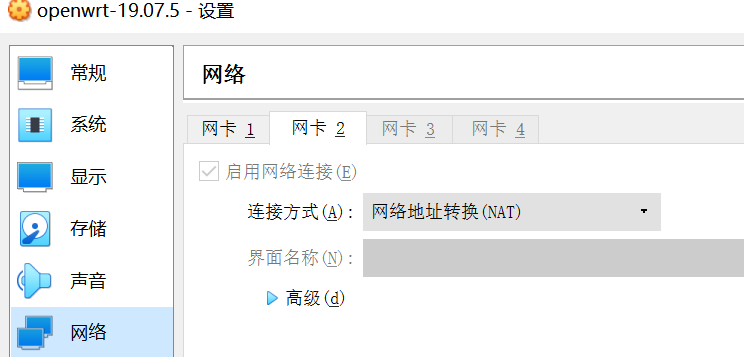
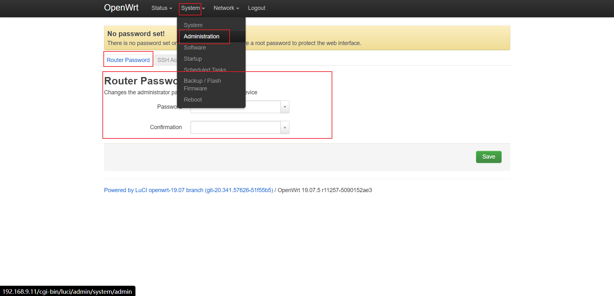
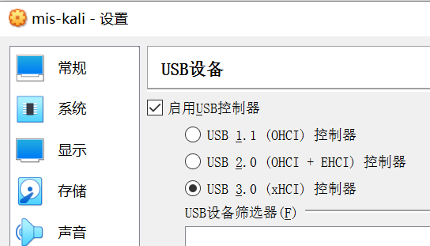

**目录**

[H1 OpenWrt 虚拟机搭建](#title)

* [实验目的](#10)
* [实验环境](#00)
* [实验要求](#01)
* [实验过程](#02)
  * [Part 0 复习VirtualBox的配置和使用](020)
  * [Part 1 下载安装OpenWrt](#021)
  * [Part 2 配置无线网卡使其正常工作](#022)
  * [Part 3 开启AP功能](#023)
  * [Part 4 使用手机连接不同配置状态下的AP对比试验](#024)
  * [Part 5 使用路由器/AP的配置导出备份功能，尝试解码导出配置文件](#025)
  * [Part 6 找到OpenWrt配置并截图](#026)
* [实验总结](#03)
* [问题和解决](#04)
* [课后作业](#05)
* [参考资料](#06)

# <span id="title">H1 OpenWrt 虚拟机搭建</span>

## <span id = "10">实验目的</span>

- 熟悉基于 `OpenWrt` 的无线接入点（AP）配置
- 为第二章、第三章和第四章实验准备好「无线软 AP」环境

## <span id = "00">实验环境</span>

- 可以开启监听模式、`AP` 模式和数据帧注入功能的 `USB`

  - 第一个自己选的网卡：[ Realtek RTL8811AU](https://c4pr1c3.github.io/cuc-mis/chap0x02/rtl8811au.html) comfast CF-915AC 2017年版（在我的电脑上不好使）

    

  - 室友的网卡：杂牌网卡（非常好用）（后续发现无法找到无线网络，手机无法连接）

    
    
  - 最丝滑的网卡： [RT3572L 带双独立可拆卸天线](https://c4pr1c3.github.io/cuc-mis/chap0x02/rt3572l.html)

    

    

- Virtualbox 6.1.18

- Kali 2020.3

- OpenWrt

- Windows 10 

## <span id = "01">实验要求</span>

- [x] 对照 [第一章 实验](https://c4pr1c3.github.io/cuc-mis/chap0x01/exp.html) `无线路由器/无线接入点（AP）配置` 列的功能清单，找到在 `OpenWrt `中的配置界面并截图证明；
- [x] 记录环境搭建步骤；
- [x] 如果 `USB` 无线网卡能在 `OpenWrt` 中正常工作，则截图证明；
- [x] 如果` USB `无线网卡不能在 `OpenWrt` 中正常工作，截图并分析可能的故障原因并给出可能的解决方法。

## <span id = "02">实验过程</span>

### <span id = "020">Part 0</span> 复习`VirtualBox`的配置和使用

* 虚拟机镜像列表

  

* 设置虚拟机和宿主机的文件共享，实现宿主机和虚拟机的双向文件共享。

  * 设置共享文件夹

  * 使用`sftp`协议实现双向文件共享。

    连接远程服务器（这里使用`windows`主机连接`kali`虚拟机）：`sftp user@ip`

    上传：`put [本地文件的地址] ([服务器上文件存储位置])`

    下载：`get [服务器上文件存储的位置] ([本地要存储的位置])`

    

* 配置`ssh`远程桌面连接

  参考上学期的实验报告配置：（上学期实验报告有小错误，已经修改）

  

* 虚拟机镜像备份和还原的方法

  * 选择`生成快照`,完成备份，之后可以通过`恢复备份`回到之前备份时的状态。

    

  * 刚创建好一个虚拟硬盘时，将虚拟硬盘更改为`多重加载`模式，之后如果想要获得一个全新的虚拟机即可选择`从已有虚拟硬盘创建`，也算是一种实现备份和还原的方法。

* 熟悉虚拟机基本网络配置，了解不同联网模式的典型应用场景

  * 联网模式选择：

  
  
  * 联网模式概述（点击图片可以跳转到官网说明文档）：
  
    [](https://www.virtualbox.org/manual/ch06.html)

### <span id = "021">Part 1 </span>下载安装`OpenWrt`

* 在`windows`上执行老师提供的[bash脚本（稍微修改了一下）](code/setup-vm.sh)【详细说明见[问题和解决——Q1](#041)】

  成功执行：（有一个报错是因为之前执行过一次，所以`vdi`文件已经创建好了）

  

* 执行完成后列表中出现自动创建好的虚拟机：

  

* 启动虚拟机：

  

* 修改`/etc/config/network` 配置文件来设置远程管理专用网卡的 `IP` 地址：

  将`hostonly`网卡的IP地址设为`192.168.56.11`（也可以修改成其他的`IP`，习惯性用这个`IP`）

  ```
  config interface 'lan'
      option type 'bridge'
      option ifname 'eth0'
      option proto 'static'
      option ipaddr '192.168.56.11' 
      option netmask '255.255.255.0'
      option ip6assign '60'
  ```

  执行命令 `ifdown eth0 && ifup eth0`，重启网卡，使配置生效。

* 输入`ip a`检查是否配置成功：

  如图，设置成功。

  

* 现在可以通过`windows`主机上访问`192.168.56.11`：

  

* 安装`LuCi`软件包：

  对于路由器操作系统 `OpenWrt` 来说，通过 `SSH` 方式来管理，常见的远程管理方式是通过 `LuCi` 这个网页形式的管理界面来完成。

  ```
  # 更新 opkg 本地缓存,每次重启系统都要更新
  opkg update
  # 安装 luci
  opkg install luci
  ```

  安装成功的后访问(其实已经自带了`luci`)：
  
  
* 此时还没有`Wireless`选项：

  

### <span id = "022">Part 2</span> 配置无线网卡使其正常工作

* 插上无线网卡,检查能否识别设备：

  在显示窗口的右下角`USB`设备看到刚插入的设备，即可以识别，勾选上刚插上的无线网卡：

  


* 在`OpenWrt`中安装`lsusb` 用以查看无线网卡的信息：

  ```
  # 每次重启 OpenWrt 之后，安装软件包或使用搜索命令之前均需要执行一次 opkg update
  opkg update && opkg install usbutils
  ```

* 查看无线网卡的驱动是否安装好：

  ```bash
  # 查看 USB 外设的标识信息
  lsusb
  
  # 查看 USB 外设的驱动加载情况
  lsusb -t
  ```

  发现能识别到无线网卡设备，但是没有加载驱动:

  
  
  执行命令`ifconfig -a`或`ip link`也无法看到有效的无线网络。
  
  
  
* 安装对应驱动

  通过`lsusb`的执行结果可知：无线网卡的芯片名称为`RTL8811AU`。

  通过 `opkg find kmod-* | grep rtl88` 命令可以快速查找可能包含指定芯片名称的驱动程序包：

  发现只有`RTL8812au`型号的驱动，（由于在搜资料的时候，有博客说可以兼容，所以下载`RTL8812AU`型号的驱动

  

* 检查驱动是否安装成功

  再次执行`lsusb -t`，发现成功加载驱动：

  

  再次执行`ip link`，可以验证系统已经可以识别此块无线网卡：

  

* `lsusb -v`执行结果：[`lsusb -v`](code/lsusb-v-result.txt)

* `iw dev`执行结果：

  ```
  root@OpenWrt:~# iw dev
  phy#0
          Interface wlan0
                  ifindex 5
                  wdev 0x1
                  addr 40:a5:ef:de:ec:cd
                  type managed
                  txpower 12.00 dBm
  ```

* `iw phy`执行结果：[`iw phy`](code/iw-phy-result.txt)

  

  可以看到此款无线网卡支持AP模式。

* `reboot`重启`OpenWrt`，网页上`NetWork`里多了一个`Wireless`选项：

  

### <span id = "023">Part 3</span> 开启`AP`功能

* 配置更安全的无线完全机制

  默认情况下，`OpenWrt` 只支持 `WEP` 系列过时的无线安全机制。为了让 `OpenWrt 支持` `WPA` 系列更安全的无线安全机制，还需要额外安装 2 个软件包：`wpa-supplicant` 和 `hostapd` 。

  ```
  # wpa-supplicant 提供 WPA 客户端认证
  # hostapd 提供 AP 或 ad-hoc 模式的 WPA 认证
  opkg install hostapd wpa-supplicant
  ```

  安装后重启。

* 为了使用其他无线客户端可以正确发现新创建的无线网络，以下还有 3 点需要额外注意的特殊配置注意事项：
  * 无线网络的详细配置界面里的 `Interface Configuration` 表单里 `Network` 记得勾选 `wan` ；

    

  * 虚拟机的 `WAN` 网卡对应的虚拟网络类型必须设置为 `NAT` 而不能使用 `NatNetwork` ，无线客户端连入无线网络后才可以正常上网。

    

  * 不要使用 `Auto` 模式的信道选择和信号强度，[均手工指定](https://forum.archive.OpenWrt.org/viewtopic.php?id=37896) 才可以。

    

* 修改后点击`Save&Apply`和`Enable`，开启`AP`：

  点击之前：

  

  点击之后：

  

  开启失败。

* 开启失败，无信号，还未解决。

  在命令行使用`ip link`查看，网卡为`UP`状态。

  尝试了重登录，重启动`OpenWrt`，重插拔无线网卡，切换不同的usb接口，重启物理主机，重新配置新的`OpenWrt`，都失败，暂时不清楚为什么。

* 后续使用室友的白色杂牌无线网卡，丝滑成功：

  

* 上面的白色杂牌网卡，虽然可以开启`AP`模式并有信号，但是`小米手机`和`iPad`上都找不到该无线网络。

* 使用上课时新换的新网卡，成功：

  

### <span id ="024">Part 4</span>  使用手机连接不同配置状态下的AP对比实验

* 如果手机无法分配到IP地址但又想联网该如何解决？


### <span id="025">Part 5</span>  使用路由器/AP的配置导出备份功能，尝试解码导出的配置文件


### <span id = "026">Part 6 </span>找到`OpenWrt`配置并截图

* 重置和恢复`AP`到出厂默认设置状态

  

* 设置`AP`的管理员用户名和密码

  登录界面：

  

  最开始只有默认没有密码的`root`用户，可以在命令行界面使用`useradd username`添加新用户和修改密码。

* 设置`SSID`广播和非广播模式

  (在`network`->`wireless`->`Edit`->`Interface Configuration`->`General Setup`里进行设置)

  

* 配置不同的加密方式

  (在`network`->`wireless`->`Edit`->`Interface Configuration`->`Wireless Security`里进行设置)

  

* 设置`AP`管理密码

  

* 配置无线路由器使用自定义的`DNS`解析服务器

  

* 配置`DHCP`和禁用`DHCP`

  (`network`->`interface`->`lan`->`edit`)

  

* 开启路由器/`AP`的日志记录功能（对指定事件记录）

  

* 配置`AP`隔离(`WLAN`划分)功能

  功能.png)

* 设置`MAC`地址过滤规则（`ACL`地址过滤器）

  

* 查看`WPS`功能的支持情况

  ```
  WPS（Wi-Fi Protected Setup，Wi-Fi保护设置）是由Wi-Fi联盟（http://www.wi-fi.org/）组织实施的认证项目，主要致力于简化无线局域网的安装及能配置工作。在传统方式下，用户安全性新建一个无线网络时，必须在接入点手动设置网络名（SSID）和安全密钥，然后在客户端验证密钥以阻止“不速之客”的闯入。这整个过程需要用户具备Wi-Fi设备的背景知识和修改必要配置的能力。Wi- Fi Protected Setup能帮助用户自动设置网络名（SSID）、配置强大的WPA数据编码及认证功能，用户只需输入个人信息码（PIN方法）或按下按钮（按钮设置，或称PBC），即能安全地连入WLAN。这大大简化了无线安全设置的操作。Wi-Fi Protected Setup支持多种通过Wi-Fi认证的802.11产品，包括接入点、无线适配器、Wi-Fi电话以及其他消费性电子设备。
  ```

  

* 查看`AP`/无线路由器支持哪些工作模式

  

## <span id = "03">实验总结</span>

## <span id = "04">问题和解决</span>

- [x] **Q0：在kali里面下载时，显示无法找到下载的的安装包，但是能够`ping`通。上网搜博客，修改`/etc/resolv.conf`之后，不行，修改回来后，连`ping`都`ping`不通了。**

  A0：修改文件`/etc/network/interfaces`，设置`dhcp`，然后重启网络，`sudo /etc/init.d/networking restart`，就可以`ping`通了，并且可以访问之前不能下载的链接。所以不要轻易修改配置文件。

  原因应该是我使用了一个多重加载的虚拟硬盘创建了两个虚拟机，并且都设置了`NAT`，`IP`地址起了冲突。

- [x] **<span id="041">Q1</span>：运行脚本安装`OpenWrt`时，修改脚本以及`windows`的配置，使得安装脚本在`windows`上成功运行。**

  * 运行环境：`Git Bash`可以提供`bash`脚本的运行环境，但是会有一些命令的缺失。

  * `git bash`没有`wget`命令：[下载wget安装包](https://eternallybored.org/misc/wget/)，并将`wget.exe`拷贝到`C:\Program Files\Git\mingw64\bin\`下面。

  * 找不到`VBoxManage`命令：在电脑上找到`VBoxManage.exe`，然后将其路径加到环境变量里。

        

    

  * 创建虚拟机失败：删掉脚本里创建虚拟机是的分组选项，因为自己的电脑没有设置分组。       

    

  *    原始脚本中第 1 块网卡的界面名称为 `vboxnet0`，但是`windows`的`virtualbox`命名方式为`VirtualBox Host-Only Ethernet Adapter` 

    选择`192.168.56.x`的网段： 

     

  解决完成上述问题后，`setup-vm.sh`运行成功，虚拟机可以正常运行。  

- [x] **Q2：执行`opkg install xx`卡住，一直不成功，也无返回结果；执行`opkg find`也无返回结果。**

  A2：在要安装驱动时，多次执行`opkg find`搜索对应驱动无果，想到源码编译，但是`opkg install git`也一直不成功，怀疑是脚本安装`OpenWrt`在我的机器上出错了。但是后来再次尝试**重启**后，`opkg`命令都能正常工作（除了有一点慢），不太清楚具体是什么原因导致之前一直失败。

- [x] **Q3：没有`USB3.0`选项。**

  

  A3：因为是新安装的`VirtualBox`，没有`USB3.0`的选项，所以要安装`virtualbox extension pack`。在[VirtalBox官网](https://www.virtualbox.org/wiki/Downloads)下载扩展包，双击安装包安装。

  安装成功：

  
  
- [x] **Q4：`iwconfig not found`**

  A4：`opkg update && opkg install wireless-tools`
  
- [x] **Q5：`AP`功能开启失败**

  A5：网卡问题，试用了两个confast网卡，一个[Atheros AR9271](https://c4pr1c3.github.io/cuc-mis/chap0x02/wn722n.html) 杂牌网卡，一个
  
  ​	在尝试了一系列重启重装都不成功后，我借到了室友的网卡。
  
  * 网卡型号：[Atheros AR9271](https://c4pr1c3.github.io/cuc-mis/chap0x02/wn722n.html) 杂牌
  
    
  
    
  
  * 插入`OpenWrt`后无法识别，没有驱动
  
    
  
  * 安装驱动
  
    
  
  * 驱动安装成功
  
    
  
  * 访问`OpenWrt`网页，点击`Enable`，丝滑地成功了!
  
    
  
  但是无法在手机上搜到名为`OpenWrt`的无线网络，只尝试了重启，无法解决。由于第二天可以更换网卡，所以没再尝试其他解决方法。
  
  * 更换的新网卡： [RT3572L 带双独立可拆卸天线](https://c4pr1c3.github.io/cuc-mis/chap0x02/rt3572l.html)
  
    
  
  * 可以识别，并且已经加载好了驱动：
  
    
  
  * 访问网页，开启无线网络：
  
  * 
  
  

## <span id = "06">参考资料</span>

* [[OpenWrt Wiki] OpenWrt on VirtualBox HowTo](https://OpenWrt.org/docs/guide-user/virtualization/virtualbox-vm)
* [windows git bash wget: command not found](https://blog.csdn.net/eddy23513/article/details/106621754/)
* [OpenWrt Forum Archive](https://forum.archive.OpenWrt.org/viewtopic.php?id=37896)
* [Chapter 6. Virtual Networking](https://www.virtualbox.org/manual/ch06.html)