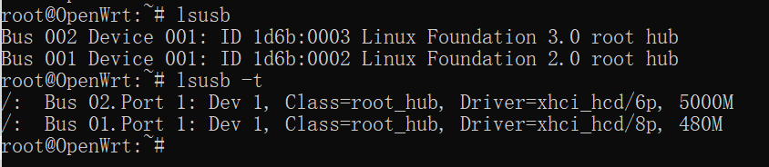

# H1 OpenWrt 虚拟机搭建

**目录**

* [实验目的](#10)
* [实验环境](#00)
* [实验要求](#01)
* [实验过程](#02)
  * [Part 0 复习VirtualBox的配置和使用](020)
  * [Part 1 下载安装`OpenWrt`](#021)
  * [022](#022)
  * [023](#023)
  * [024](#024)
  * [025](#025)
  * [026](#026)
* [实验总结](#03)
* [问题和解决](#04)
* [课后作业](#05)
* [参考资料](#06)


## <span id = "10">实验目的</span>

- 熟悉基于 OpenWrt 的无线接入点（AP）配置
- 为第二章、第三章和第四章实验准备好「无线软 AP」环境

## <span id = "00">实验环境</span>

- 可以开启监听模式、AP 模式和数据帧注入功能的 USB 无线网卡
- Virtualbox 6.1.18
- Kali 2020.3

## <span id = "01">实验要求</span>

- [ ] 对照 [第一章 实验](https://c4pr1c3.github.io/cuc-mis/chap0x01/exp.html) `无线路由器/无线接入点（AP）配置` 列的功能清单，找到在 OpenWrt 中的配置界面并截图证明；
- [ ] 记录环境搭建步骤；
- [ ] 如果 USB 无线网卡能在 `OpenWrt` 中正常工作，则截图证明；
- [ ] 如果 USB 无线网卡不能在 `OpenWrt` 中正常工作，截图并分析可能的故障原因并给出可能的解决方法。


## <span id = "02">实验过程</span>

### <span id = "020">Part 0</span> 复习VirtualBox的配置和使用

* 重新安装了Kali2020，网卡选择：`NAT`+`Host-Only`。

* 将虚拟硬盘更改为`多重加载`。

* 配置`ssh`远程桌面连接。

  （参考上学期的实验报告，上学期实验报告有小错误，已经修改。）

  

* 设置虚拟机和宿主机的文件共享，实现宿主机和虚拟机的双向文件共享。

  使用`sftp`协议实现双向文件共享。

  连接远程服务器（这里使用windows主机连接kali虚拟机）：`sftp user@ip`

  上传：`put [本地文件的地址] ([服务器上文件存储位置])`

  下载：`get [服务器上文件存储的位置] ([本地要存储的位置])`

  

### <span id = "021">Part 1 </span>下载安装`OpenWrt`

* 在windows上执行老师提供的[bash脚本（稍微修改了一下）](code/setup.sh)【详细说明见[问题和解决——Q1](#041)】

  成功执行：（有一个报错是因为之前执行过一次，所以vdi文件已经创建好了）

  

* 执行完成后列表中出现自动创建好的虚拟机：

  

* 启动虚拟机：

  

* 修改`/etc/config/network` 配置文件来设置远程管理专用网卡的 IP 地址：

  将hostonly网卡的IP地址设为`192.168.56.11`（也可以修改成其他的IP，习惯性用这个IP）

  ```
  config interface 'lan'
      option type 'bridge'
      option ifname 'eth0'
      option proto 'static'
      option ipaddr '192.168.56.11' 
      option netmask '255.255.255.0'
      option ip6assign '60'
  ```

  执行命令 `ifdown eth0 && ifup eth0`，重启网卡，使配置生效。

* 输入`ip a`检查是否配置成功：

  如图，设置成功。

  

* 现在可以通过windows主机上访问`192.168.56.11`：

  

* 安装`LuCi`软件包：

  对于路由器操作系统 `OpenWrt` 来说，通过 `SSH` 方式来管理，常见的远程管理方式是通过 `LuCi` 这个网页形式的管理界面来完成。

  ```
  # 更新 opkg 本地缓存,每次重启系统都要更新
  opkg update
  # 安装 luci
  opkg install luci
  ```

  安装成功的后访问：

  

### <span id = "022">Part 2</span> 开启AP功能

* 插上无线网卡：

  在显示窗口的右下角USB设备中勾选上刚插上的无线网卡：

  

* 查看是否能识别无线网卡：

  ```
  # 查看物理网卡的硬件和软件特性支持情况
  iw phy
  iw list
  ```

  

* 在OpenWrt中安装lsusb ：

  ```
  # 每次重启 OpenWRT 之后，安装软件包或使用搜索命令之前均需要执行一次 opkg update
  opkg update && opkg install usbutils
  ```

* 查看无线网卡的驱动是否安装好：

  ```bash
  # 查看 USB 外设的标识信息
  lsusb
  
  # 查看 USB 外设的驱动加载情况
  lsusb -t
  ```

  没有安装好：

  


### <span id = "023">Part 3</span>

### <span id = "024">Part 4 </span>

### <span id = "025">Part 5 </span>

### <span id = "026">Part 6 </span>

## <span id = "03">实验总结</span>

## <span id = "04">问题和解决</span>

- [ ] **Q0：在kali里面下载时，显示无法找到什么什么，但是能够ping通。上网搜博客，修改/etc/resolv.conf之后，不行，修改回来后，连ping都ping不通了。**

  A0：修改文件/etc/network/interfaces，设置dhcp，然后重启网络，sudo /etc/init.d/networking restart，就可以ping通了，并且可以访问之前不能下载的链接。

- [ ] **<span id="041">Q1</span>：运行脚本安装openwrt时，修改脚本以及windows的配置，使得安装脚本在windows上成功运行。**

  * 运行环境：`Git Bash`可以提供bash脚本的运行环境，但是会有一些命令的缺失。

  * git bash没有wget命令：[下载wget安装包](https://eternallybored.org/misc/wget/)，并将wget.exe拷贝到C:\Program Files\Git\mingw64\bin\下面。

  * 找不到VBoxManage命令：在电脑上找到VBoxManage.exe，然后将其路径加到环境变量里。

        

    

  * 创建虚拟机失败：删掉脚本里创建虚拟机是的分组选项，因为自己的电脑没有设置分组。       

    

  *    原始脚本中第 1 块网卡的界面名称为 vboxnet0，但是windows的virtualbox命名方式为VirtualBox Host-Only Ethernet Adapter  

    选择`192.168.56.x`的网段： 

     

  解决完成上述问题后，setup-vm.sh运行成功，虚拟机可以正常运行。  

- [ ] Q2：

- [ ] **Q3：没有USB3.0选项。**

  

  A3：因为是新安装的VirtualBox，没有USB3.0的选项，所以要安装`virtualbox extension pack`。在VirtalBox官网（https://www.virtualbox.org/wiki/Downloads）下载扩展包，双击安装包安装。

  安装成功：

  

## <span id = "5">课后作业</span>

## <span id = "06">参考资料</span>

* [[OpenWrt Wiki] OpenWrt on VirtualBox HowTo](https://openwrt.org/docs/guide-user/virtualization/virtualbox-vm)
* [windows git bash wget: command not found](https://blog.csdn.net/eddy23513/article/details/106621754/)
* [reference](link)
* [reference](link)