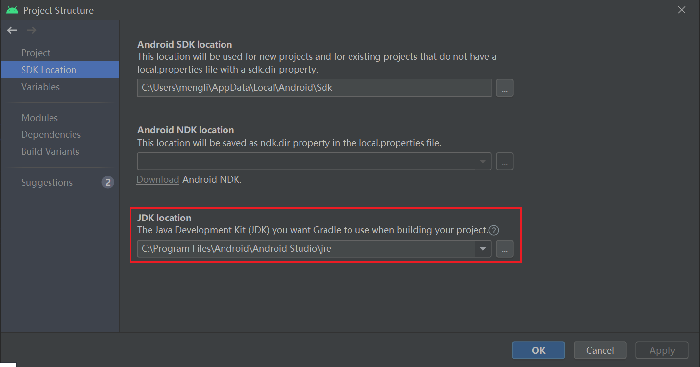
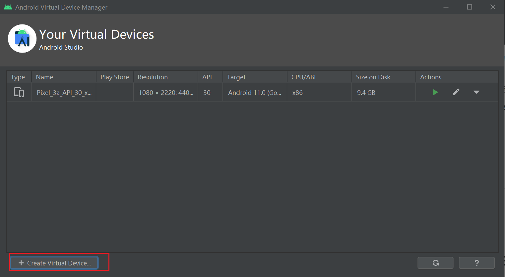
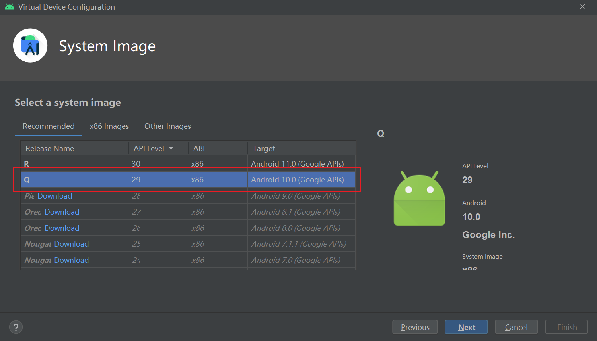
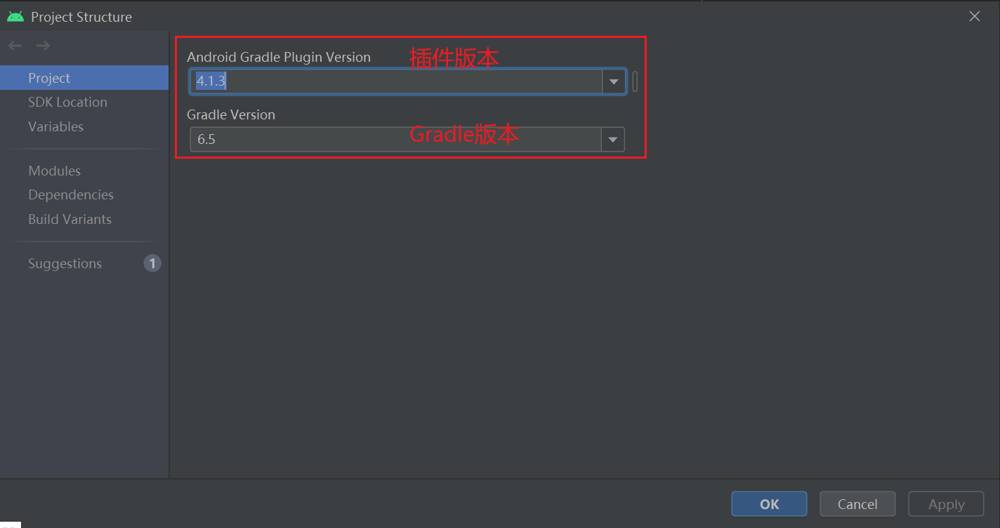

# H5 Android 模拟器环境搭建笔记

## 目录

[实验要求](#00)

[实验环境](#01)

[实验过程](#02)

​			[Part 0 安装和配置Java SDK](#020)

​			[Part 1 安装Android Studio](#021)

​			[Part 2 下载安装Android SDK](#022)

​			[Part 3 配置Android模拟器运行环境](#023)

​			[Part 4 配置Gradle编译环境](#024)

[问题和解决](#03)

[参考资料](#04)

## 实验要求

* Android 模拟器环境搭建

## 实验环境

* windows 10 
* Android Studio 4.1.3

## 实验过程

### Part 0 安装和配置Java SDK

Android Studio 安装后已经内置了 Java 运行时环境，通过菜单 File -> Project Structure -> SDK Location 可以查看到 Android Studio 在编译当前项目时使用的 JDK 目录。

### Part 1 安装Android Studio

通过官方网站下载[Android Studio](https://developer.android.com/studio/) 最新版本并根据提示安装，这里安装的是`Android Studio 4.1.3`。

初次启动提示找不到`Android SDK`，采用**跳过检测**的方法解决。（解决过程记录在[问题和解决 Q1](#jump1)）

安装成功：

### Part 2 下载安装Android SDK

在启动 Android Studio 之后可以通过启动界面的菜单选项 Configure -> SDK Manager 启动 SDK Manager 。

可以看到，已经自动安装了`Android 11.0`。

在安装`Android 10.0`，为本人手机目前的`Android`版本。

安装成功。

### Part 3 配置Android模拟器运行环境

安装 Intel x86 Emulator Accelerator (HAXM installer)。

可以看到，新版本已经自动安装成功**Android Emulator** 组件。

参阅[官方文档](https://developer.android.com/studio/run/emulator)在 Android 模拟器上运行应用

* 在 Android Studio 中创建一个 Android 虚拟设备 (AVD)

  * AVD Manager -> Create Virtual Decices

    

  * 选择硬件型号（Phone + Pixel 4XL）

    

  * 选择Android版本（API Level 29 + ABI x86 + Android 10.0）

    

  * 验证配置是否正确

    

  * 创建成功

    

* 直接点击Action的第一个箭头在模拟器中展示

  

* 可以使用在不同的AVD上运行自己写的功能代码

  

### Part 4 配置Gradle编译环境

通过`File->Project Structure->Project`查看`Gradle`插件版本，已经安装对应版本的Gradle插件和Gradle。

**Gradle和Gradle插件：**

* Android Studio的编译系统使用的是Gradle自动执行和管理构建流程，Android Plugin for Gradle增加了编译Android APP所需要的特性。 

* Gradle 和 Android 插件独立于 `Android Studio` 运行。所以更新`Android Studio`需要单独更新Gradle和Android插件。

* Gradle 和 Android 插件版本对应关系：

  

## 问题和解决

- [x] Q1：初次安装`Android Studio`，启动后报错：`Unable to access Android SDK add-on list`。

  

  原因：`Android Studio`启动后会在默认路径下检测是否有`Android SDK`，如果没有的话就会报上述错误。

  A1：因为还没有安装SDK，所以采取**跳过检测**的方法解决此问题。

  * 在`Android Studio`的安装目录下，找到`\bin\idea.properties`

  * 在尾行添加`disable.android.first.run=true`，表示初次启动不检测SDK

    

## 参考资料

* [移动网络安全第五章实验指南](https://c4pr1c3.github.io/cuc-mis/chap0x05/exp.html)
* [Android Studio报错unable to access android sdk add-on list解决方案](https://blog.csdn.net/u010358168/article/details/81535307)
* [在 Android 模拟器上运行应用  |  Android 开发者  |  Android Developers](https://developer.android.com/studio/run/emulator)
* [配置构建  |  Android 开发者  |  Android Developers](https://developer.android.com/studio/build)
* [Android Gradle 插件版本说明](https://developer.android.com/studio/releases/gradle-plugin)

