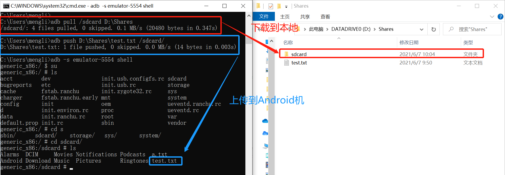

# H6 Android Hello World 应用开发和 ADB 实验

**目录**

* [实验目的](#0)
* [实验环境](#1)
* [实验要求](#2)
* [实验过程](#3)
  * [`Part 0 ADB`实验](#30)
    * [0.0 命令行](#300)
    * [0.1 Activity Manager（am）](#301)
    * [0.2 软件包管理器（pm）](#302)
    * [0.3 其他adb实验](#303)
  * [`Part 1 Hello World v1`](#31)
    * [1.0 运行展示](#310)
    * [1.1 代码编写](#311)
    * [1.2 回答问题](#312)
  * [`Part 2 Hello World v2`](#32)
* [实验总结](#4)
* [问题和解决](#5)
* [参考资料](#6)


## <span id ="0">实验目的</span>

* 熟悉 使用 Android Studio 开发应用
* 熟悉 APP的代码如何实现APP的功能，为后续安全实验做准备

## <span id ="1">实验环境</span>

* Andriod Studio 4.1.3 （开发平台）

* Piexl XL API 27 （模拟器）

  

* Windows 10 （主机）

## <span id ="2">实验要求</span>

- ✅`ADB`实验
- ✅`Hello World v1`
- ✅`Hello World v2`

## <span id ="3">实验过程</span>

### <span id ="30">Part 0 `ADB`实验 </span>

#### <span id ="300">0.0 命令行</span>

* 命令行连接模拟器

  ```bash
  # 查看开启的模拟器
  adb devices
  # 如果运行失败，提示没有adb命令，要手动将adb的路径加到环境变量中，详细见Q0
  
  # 连接模拟器终端
  adb -s emulator-5554 shell
  
  # 输出环境变量PATH
  echo $PATH
  
  # 查看当前系统版本（on Android 7.1.1 (Google APIs）x86_64 ，部分系统中没有提供 uname）
  uname -a
  ```

  

* 基本命令

  ```bash
  # 与linux基本相同。因为是Android模拟器是基于linux内核开发的。
  # cd / ls / pwd / ps / grep /kill / cat / chmod /chown / mkdir /echo /
  # touch / du / df / set / uptime / top / ifconfig / more
  ```

* 进阶命令

  ```bash
  # 与linux基本相同
  # su / iptables / iftop / lsof / mount / vmstat / wpa_cli / sqlite3
  
  # 将文件复制到设备/从设备复制文件
  # 因为只开启了一台Android设备，所以没有显示指定模拟器
  adb pull remote local
  adb push local remote
  
  # 还可以使用 adb pull 下载截图和录屏到本地
  
  # 安装应用
  adb install path_to_apk
  ```
  
  

#### <span id ="301">0.1 Activity Manger（am）</span>

在Android中，除了从界面上启动程序之外，还可以从命令行启动程序，使用的是命令行工具am (activity manager ).

* 实例命令：

  ```shell
  # am 要在adb命令行中执行
  adb -s emulator-5554 shell
  
  # Camera（照相机）的启动方法为:
  am start -n com.android.camera/com.android.camera.Camera
  
  # Browser（浏览器）的启动方法为：
  am start -n com.android.browser/com.android.browser.BrowserActivity
  
  # 本台机器没有配置camera和Broswer功能，所以代码执行结果是 not exist
  
  # 启动浏览器 :
  am start -a android.intent.action.VIEW -d  http://sec.cuc.edu.cn/
  
  # 拨打电话 :
  am start -a android.intent.action.CALL -d tel:10086
  
  # 发短信：
  am start -a android.intent.action.SENDTO -d sms:10086 --es sms_body ye --ez exit_on_sent true
  ```

* 实例执行过程录屏：

  

  对应命令执行过程：

  

#### <span id ="302">0.2 软件包管理器（pm）</span>

在 adb shell 中，可以使用[软件包管理器 (pm)](https://developer.android.com/studio/command-line/adb.html#pm) 工具发出命令，以对设备上安装的应用软件包进行操作和查询。在 shell 中，此语法为：

```bash
pm command
```

也可以直接从 adb 发出软件包管理器命令，无需进入远程 shell。例如：

```bash
adb shell pm command
adb shell pm uninstall com.example.MyApp
```

其他：

```shell
# 获取屏幕截图
screencap /sdcard/screen.png
adb shell screencap /sdcard/screen.png

# 屏幕录制
screenrecord /sdcard/demo.mp4
adb shell screenrecord /sdcard/demo.mp4
# 按Ctrl+c结束录屏
```


#### <span id ="303">0.3 其他adb实验</span>

* 官方链接：[KeyEvent  |  Android 开发者  |  Android Developers](https://developer.android.com/reference/android/view/KeyEvent)

  ```shell
  # 常用的按键对应的KEY_CODE
  adb shell input keyevent 22 //焦点去到发送键
  adb shell input keyevent 66 //回车按下
  
  adb shell input keyevent 4 // 物理返回键
  adb shell input keyevent 3 // 物理HOME键
  
  # android 4.0+
  $ input
  usage: input ...
         input text <string> # 输入文本
         input keyevent <key code number or name> # 执行KEY_CODE对应的代码
         input tap <x> <y> # 点击 x,y与屏幕尺寸有关
         input swipe <x1> <y1> <x2> <y2> # 滑动屏幕
  ```

* 实例：

  ```shell
  # 输入 hello
  adb shell input text "hello"
  # 点击屏幕上的button，根据测试和屏幕分辨率1440x2560，测出button的大致位置为（1350,400）
  adb shell input tap 1350 400
  # 按返回键
  adb shell input keyevent 4
  # 按HOME键
  adb shell input keyevent 3
  ```

* 录屏：

  

* 代码执行过程：

  

### <span id ="31">Part 1 `Hello World v1` </span>

#### <span id ="310">1.0 运行展示</span>


#### <span id ="311">1.1 代码编写</span>

阅读Android官方给出的[使用Android Studio一步一步创建并运行的Hello World程序指南](https://developer.android.google.cn/training/basics/firstapp/creating-project.html)，按照官方指南编写。实际编写中要注意一下几点：

* 为了v2版的示例代码提供上下文环境的一个示范，要求以下设置：

  ```java
  Application Name设置为：MISDemo
  Company Domain设置为：cuc.edu.cn
  ```

  

* 由于实验中进行了删除和多次添加模块，所以模块id和默认不一致，本实验中为：

  ```java
  // MainActivity.java
  // EditText editText = (EditText) findViewById(R.id.editText);
  EditText editText = (EditText) findViewById(R.id.editTextTextPersonName3);
   
  // DisplayMessageActivity.java
  // TextView textView = findViewById(R.id.textView);
  TextView textView = findViewById(R.id.textView3);
  ```
  
  通过对应的`xml`文件查看使用的模块的`id`：
  
  
  
  

#### <span id ="312">1.2 回答问题</span>

- [✅] 按照向导创建的工程在模拟器里运行成功的前提下，生成的APK文件在哪儿保存的？

  ```bash
  \Users\[username]\AndroidStudioProjects\MISDemo\app\buid\outputs\apk\debug
  ```

  

- [✅] 使用adb shell是否可以绕过MainActivity页面直接“唤起”第二个DisplayMessageActivity页面？是否可以在直接唤起的这个DisplayMessageActivity页面上显示自定义的一段文字，比如：你好移动互联网安全

  可以。

  ```bash
  # 首先要修改 app->manifests->AndroidManifest.xml
  # 设置 android:exported="true"
  <activity android:name=".DisplayMessageActivity" android:parentActivityName=".MainActivity" android:exported="true">
  
  # 通过adb shell 启用 APP 或者 Activity 的命令为：
  adb shell am start -n package/launch_activity
  
  # 命令的关键在于获取package和launch_activity
  # 首先正常打开MainActivity，点击send打开DisplayMessageActivity页面
  # 在命令行中输入下面命令获得package和launch_activity：
  adb shell dumpsys window windows | findstr Current
  #  mCurrentFocus=Window{682dc5d u0 cuc.edu.cn/cuc.edu.cn.DisplayMessageActivity}
  
  # 获取信息后关掉该进程，在命令行中输入一下命令即可绕过第一个页面唤起第二个页面：
  adb shell am start -n cuc.edu.cn/cuc.edu.cn.DisplayMessageActivity --es "com.example.myfirstapp.MESSAGE" "你好移动互联网安全"
  ```

  查看package和launch_activity信息：

  

  输入`am start -n`命令直接唤起第二个界面的录屏：

  

  

- [✅] 如何实现在真机上运行你开发的这个Hello World程序？

  官方链接：[在硬件设备上运行应用  |  Android 开发者  |  Android Developers](https://developer.android.google.cn/studio/run/device)

  设置开发环境和 Android 设备，以便通过 Android 调试桥 (ADB) 连接进行测试和调试。

- [✅] 如何修改代码实现通过 `adb shell am start -a android.intent.action.VIEW -d http://sec.cuc.edu.cn/` 可以让我们的cuc.edu.cn.misdemo程序出现在“用于打开浏览器的应用程序选择列表”？

  在`APP->manifests->AndroidManifest.xml`中添加代码：

  ```java
  // AndroidManifest.xml  <activity android:name=".MainActivity">
  <action android:name="android.intent.action.VIEW" />
  <category android:name="android.intent.category.DEFAULT" />
  <category android:name="android.intent.category.BROWSABLE" />
  <data android:scheme="http" />
  <data android:scheme="https" />
  ```

  

  添加后点击`Run`会重新生成。

  模拟器内发生的变化：

  * 列表中找不到原先的程序`MISDemo`，但是可以通过命令行`am start -n`命令启动`MainActivity`

    ```bash
    adb shell am start -n cuc.edu.cn/cuc.edu.cn.MainActivity
    ```

- [✅] 如何修改应用程序默认图标？

  `app > res > mipmap > 新建 Image Assert`

  

  原始设置：

  

  修改后保存并`Run 'app'`：

  

  模拟器中发生变换：

  

- [✅] 如何修改代码使得应用程序图标在手机主屏幕上实现隐藏？

  在`app->manifests->AndroidManifest.xml`中添加代码并点击`Run 'app'`：

  ```java
  ...
                  <data
                      android:host="MainActivity"
                      android:scheme="com.key.poc" />
  ...
  ```

  

  查看模拟器应用列表发现隐藏成功：

  

### <span id ="32">Part 2 `Hello World v2` </span>

- 在v1基础之上，我们增加以下新功能来为后续的程序逆向和组件安全实验做一些“标靶”
  - 使用SharedPreferences持久化存储小数据并按需读取
  - 实现一个简单的注册码校验功能
- MainActivity.java
- DisplayMessageActivity.java

## <span id ="4">实验总结</span>

## <span id ="5">问题和解决</span>

- [x] Q0：在命令行输入`adb devices`显示无此命令

  A0：将`C:\Users\mengli\AppData\Local\Android\Sdk\platform-tools`添加到环境变量`path`下。

- [x] Q1：修改代码后，模拟器中没有变化

  A1：因为没有`Run 'app'`，所以还没有更新。

- [x] Q2：模拟器自带的录屏功能不好用，模拟设备的screenrecord不能录到鼠标操作

  A2：使用`win+G`调用windows自带的录屏功能，然后将得到的`MP4`文件转为`GIF`。在互联网上发现一个非常好用的转换网站：[tt0.top](https://tt0.top/)

- [ ] Q3：

## <span id ="6">参考资料</span>

* [Documentation  |  Android 开发者  |  Android Developers](https://developer.android.google.cn/docs)
* [课本 · 第六章实验 · 移动互联网安全](https://c4pr1c3.github.io/cuc-mis/chap0x06/exp.html)
* [课件 · 第六章 · · 移动互联网安全](https://c4pr1c3.github.io/cuc-mis-ppt/chap0x06.md.html)
* [移动互联网安全（2021）_哔哩哔哩 (゜-゜)つロ 干杯~-bilibili](https://www.bilibili.com/video/BV1rr4y1A7nz?from=search&seid=6142859782746666446)
* [2018-NS-Public-jckling/mis-0x06 at master · CUCCS/2018-NS-Public-jckling](https://github.com/CUCCS/2018-NS-Public-jckling/tree/master/mis-0x06)
* [如何使用am命令启动Android应用](https://baijiahao.baidu.com/s?id=1588822463127131804&wfr=spider&for=pc)


