# H7 Hello World v2版逆向实验

**目录**

* [实验目的](#00)
* [实验环境](#01)
* [实验要求](#02)
* [实验过程](#03)
  * [Part 0 生成app-release.apk](#030)
  * [Part 1 smali代码分析](#031)
  * [Part 2 两个破解思路](#032)
  * [Part 3 重打包和重签名](#033)
  * [Part 4 破解效果展示](#034)
  * [Part 5 对APK文件进行程序图标替换](#035)
  * [Part 6 在同一台机器上再次安装重新打包的apk](#036)
* [问题和解决](#05)
* [参考资料](#07)

## <span id="00">实验目的</span>

* 逆向软件系列实验

## <span id="01">实验环境</span>

* Windows 10
* Android Studio 4.2.1(Andriod Studio 4.1.3导入项目失败，所以更新到最新版本 )
* apktool 5.2.1
* Atom

## <span id="02">实验要求</span>

- [x] 使用apktool反汇编上一章实验中我们开发的Hello World v2版程序，对比Java源代码和smali汇编代码之间的一一对应关系。
- [x] 对Hello World v2版程序生成的APK文件进行程序图标替换，并进行重打包，要求可以安装到一台未安装过Hello World v2版程序的Android模拟器中。
- [x] 尝试安装重打包版Hello World v2到一台已经安装过原版Hello World v2程序的模拟器中，观察出错信息并解释原因。
- [x] 去掉Hello World v2版程序中DisplayMessageActivity.java代码中的那2行日志打印语句后编译出一个新的apk文件，假设文件名是：misdemo-v3.apk，尝试使用课件中介绍的几种软件逆向分析方法来破解我们的认证算法。

## <span id="03">实验过程</span>

### <span id="030">Part 0 生成app-release.apk</span>

* 检出[Deliberately Vulnerable Android Hello World](https://github.com/c4pr1c3/DVAHW)最新版代码，在Android Studio中导入该项目；

* `Build` -> `Generate Signed Bundle or APK`

  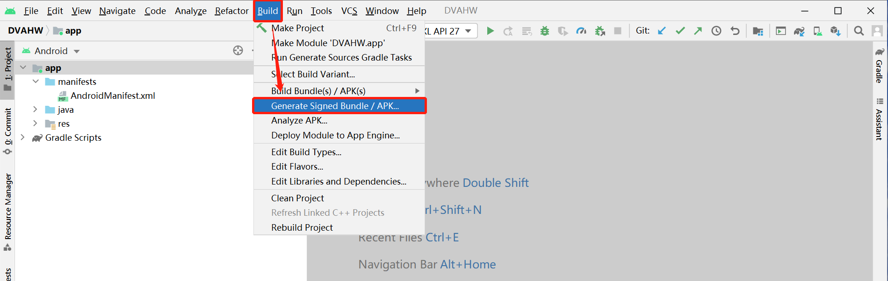

* 选择`APK`

* 选择密钥库路径和密钥别名，输入密钥库密码和`alias`密码(如果没有创建密钥库，则先`CreateNewKeyStore`)

* 生成发布版`apk`文件

  ```说明
  v1和v2的签名使用
  1）只勾选v1签名并不会影响什么，但是在7.0上不会使用更安全的验证方式
  2）只勾选V2签名7.0以下会直接安装完显示未安装，7.0以上则使用了V2的方式验证
  3）同时勾选V1和V2则所有机型都没问题
  ```

  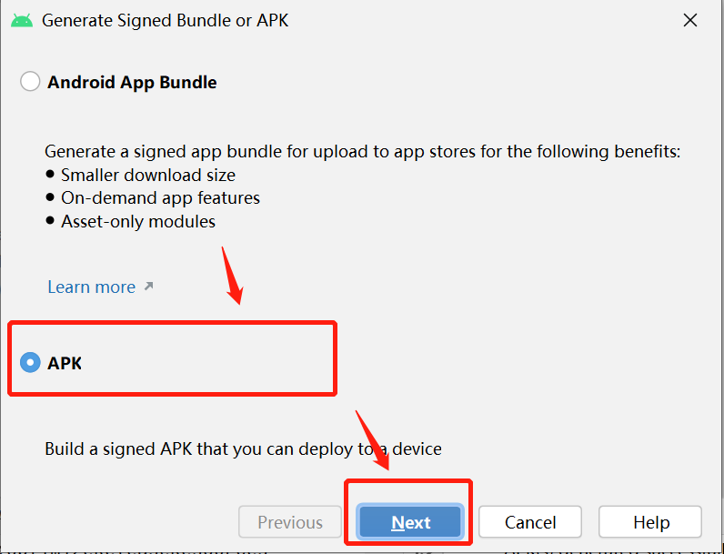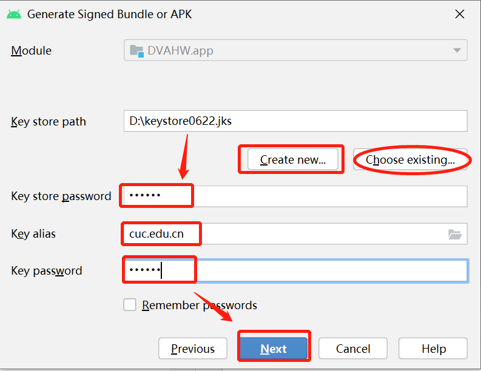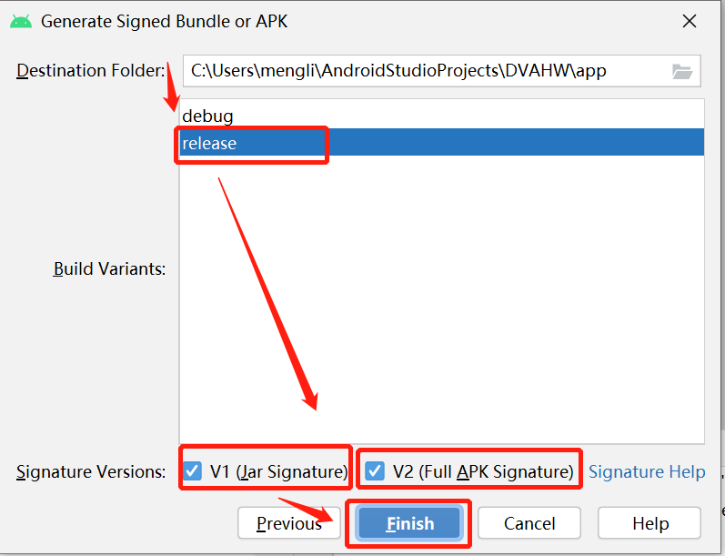

  生成成功：

  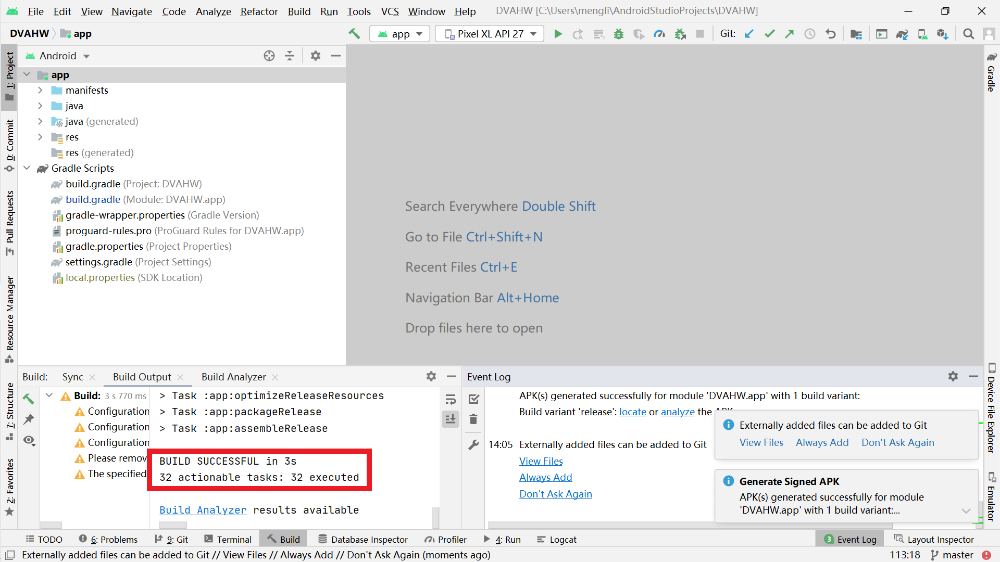

* 生成的发布版`apk`文件位于项目根目录下相对路径：`app/release/app-release.apk`；

  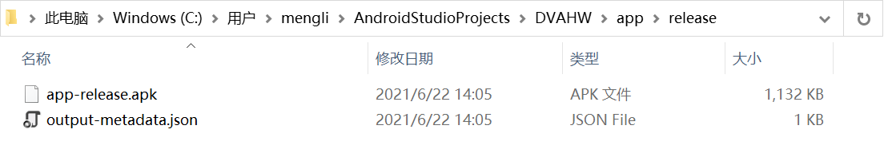


### <span id="031">Part 1 smali代码分析</span>

* 安装`apktool`工具，安装过程：*[问题和解决 · Q&A2](#QA2)*

  ```shell
  # apktool -h
  usage: apktool
   -advance,--advanced   prints advance information.
   -version,--version    prints the version then exits
  usage: apktool if|install-framework [options] <framework.apk>
   -p,--frame-path <dir>   Stores framework files into <dir>.
   -t,--tag <tag>          Tag frameworks using <tag>.
  usage: apktool d[ecode] [options] <file_apk>
   -f,--force              Force delete destination directory.
   -o,--output <dir>       The name of folder that gets written. Default is apk.out
   -p,--frame-path <dir>   Uses framework files located in <dir>.
   -r,--no-res             Do not decode resources.
   -s,--no-src             Do not decode sources.
   -t,--frame-tag <tag>    Uses framework files tagged by <tag>.
  usage: apktool b[uild] [options] <app_path>
   -f,--force-all          Skip changes detection and build all files.
   -o,--output <dir>       The name of apk that gets written. Default is dist/name.apk
   -p,--frame-path <dir>   Uses framework files located in <dir>.
  ```

* Decoding 反编译为Smali 语言

  在上一部分生成的`app-release.apk`所在目录下执行命令：`apktool d app-release.apk`

  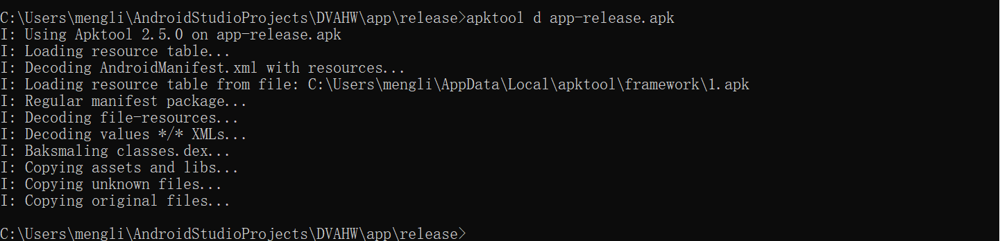

  反汇编出来的`smali`代码位于apktool输出目录下的 **smali** 子目录，源代码目录中的 **res** 目录也位于输出目录的一级子目录下。

  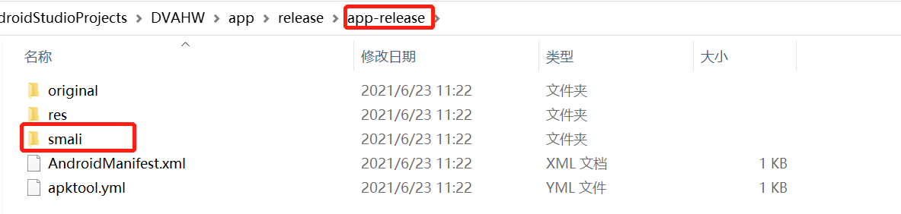

* 在反汇编输出目录下进行**关键字查找**

  ```bash 
  grep '注册失败' -R .
  ```

  

  [Deliberately Vulnerable Android Hello World](https://github.com/c4pr1c3/DVAHW)在模拟器中运行，输入注册码错误时的提示信息为：**注册失败**。依据此**关键特征**，在反汇编输出目录下进行**关键字查找**，可以在 `res/values/strings.xml` 中找到该关键字的注册变量名为`register_failed`。

  注：widows没有grep命令，使用git bash窗口。

  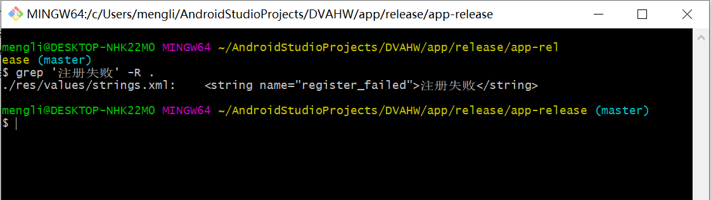

* 用文本编辑器打开 `res/values/strings.xml` 查看会在上述代码行下一行发现：

  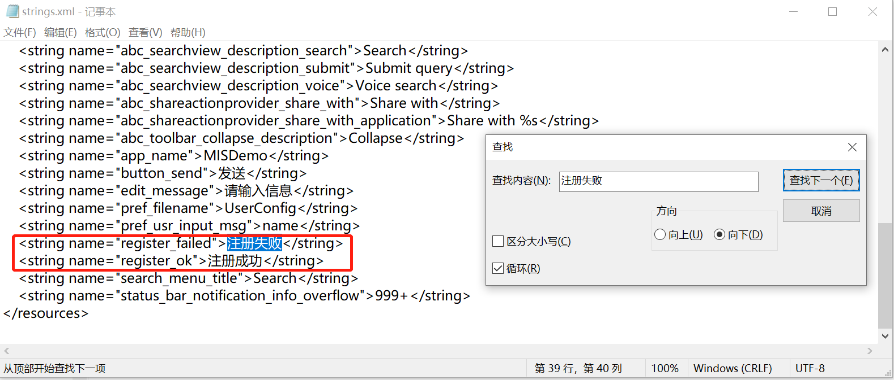

* 继续在反汇编输出目录下进行**关键字查找**：`register_ok`，可以发现：

  ```bash 
  grep 'register_ok' -R .
  ```

  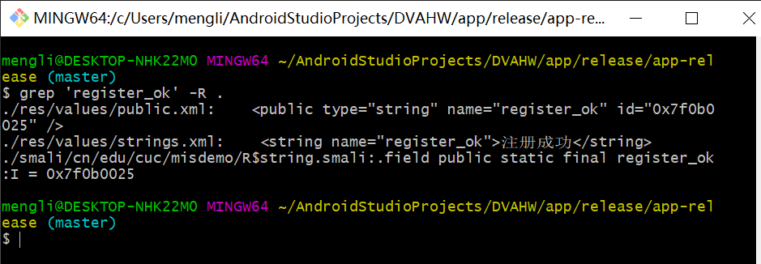

* 现在，我们有了`register_ok`的资源唯一标识符：`0x7f060025`，使用该唯一标识符进行关键字查找，我们可以定位到这一段代码：

  ```bash
  ./smali/cn/edu/cuc/misdemo/DisplayMessageActivity.smali:    const v0, 0x7f0b0025
  ```

  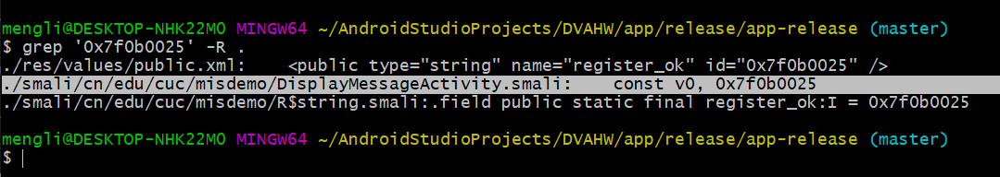

* 用文本编辑器（本书使用[atom](https://atom.io/)）打开上述`DisplayMessageActivity.smali`，定位到包含该资源唯一标识符所在的代码行。同时，在Android Studio中打开`DisplayMessageActivity.java`源代码，定位到包含`textView.setText(getString(R.string.register_ok));`的代码行，如下图所示：

  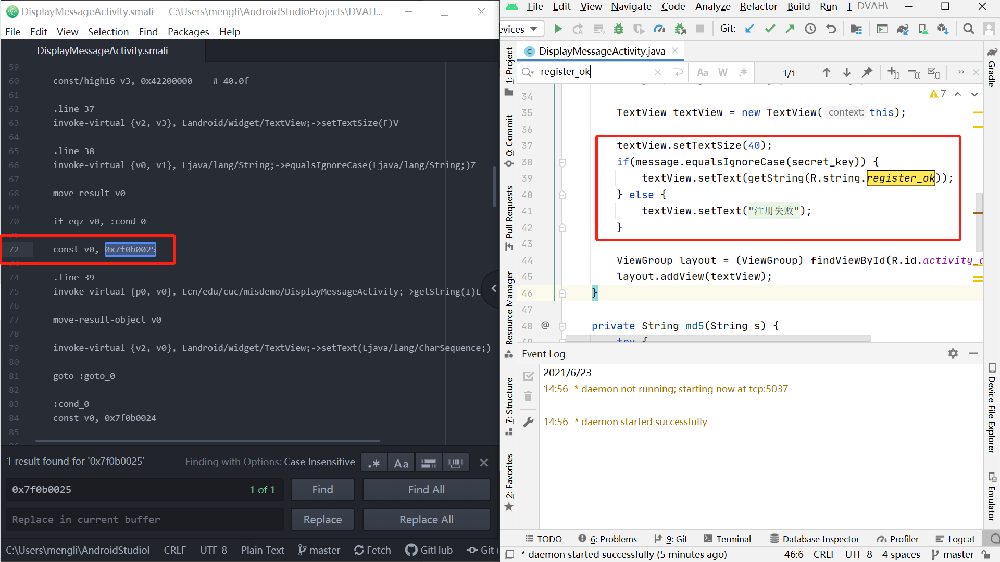

* 根据源代码行号和smali代码中的`.line 39`，我们可以找到Android源代码中的Java代码和Smali代码之间的对应“翻译”关系。上述smali代码注释说明如下：

  ```bash
      if-eqz v0, :cond_0
      
  # 将 0x7f060027 赋值给寄存器v6
      const v0, 0x7f0b0025
      
  # 当前smali代码对应源代码的行号
      .line 39
      
  # invoke-virtual 是调用实例的虚方法（该方法不能是 private、static 或 final，也不能是构造函数）
  # 在非static方法中，p0代指this
  # 此处的实例对象是 cn.edu.cuc.misdemo.DisplayMessageActivity
  # Lcn/edu/cuc/misdemo/DisplayMessageActivity; 表示DisplayMessageActivity这个对象实例 getString是具体方法名
  # I表示参数是int类型
  # Ljava/lang/String; 表示 Java内置的String类型对象
  # 整个这一行smali代码表示的就是 调用 cn.edu.cuc.misdemo.DisplayMessageActivity对象的getString方法，传入一个整型参数值，得到String类型返回结果
      invoke-virtual {p0, v0}, Lcn/edu/cuc/misdemo/DisplayMessageActivity;->getString(I)Ljava/lang/String;
  # 将最新的 invoke-kind 的对象结果移到指定的寄存器中。该指令必须紧跟在（对象）结果不会被忽略的 invoke-kind 或 filled-new-array 之后执行，否则无效。
  # 其中 kind 典型取值如virtual、super、direct、static、interface等，详见Android开源官网的 'Dalvik 字节码' 说明文档
      move-result-object v0
  
  # 当前initView()方法通过 .locals 定义了4个本地寄存器，用于保存局部变量，如下2行代码所示：
  # .method private initView()V
  #    .locals 4
      
  # V 表示 setText 的返回结果是 void 类型
      invoke-virtual {v2, v0}, Landroid/widget/TextView;->setText(Ljava/lang/CharSequence;)V
  
      goto :goto_0
  ```


### <span id="032">Part 2 两个破解思路</span>

搞懂了上述smali代码的含义之后，我们破解这个 **简单注册小程序** 的思路可以归纳如下：

#### 思路一 修改判断条件

改变原来的注册码相等条件判断语句，对布尔类型返回结果直接取反，达到：只要我们没有输入正确的验证码，就能通过验证的“破解”效果；

- 将 `if-eqz` 修改为 `if-nez`

  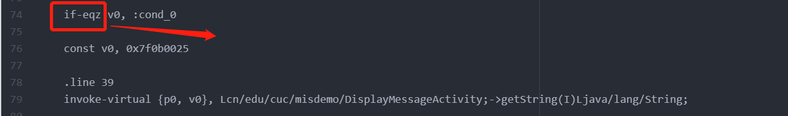

#### 思路二 打印比对值，获取正确的验证码

在执行注册码相等条件判断语句之前，打印出用于和用户输入的注册码进行比较的“正确验证码”变量的值，借助`adb logcat`直接“偷窥”到正确的验证码；

- 在执行注册码相等条件判断语句之前，打印出用于和用户输入的注册码进行比较的“正确验证码”变量的值，借助`adb logcat`直接“偷窥”到正确的验证码；

  在 `invoke-virtual {v2, v3}, Ljava/lang/String;->equalsIgnoreCase(Ljava/lang/String;)Z` 代码之前增加2行打印语句

  ```smali
  # .method private initView()V
  #    .locals 9
  # 注意修改上述initView()方法下的.locals值从8到9
  const-string v8, "tag-here"
  invoke-static {v8, v3}, Landroid/util/Log;->v(Ljava/lang/String;Ljava/lang/String;)I
  ```

- 注意：自己实际操作和老师给的实验指导代码不完全相同，自己的smali代码中initView()定义了4个变量，所以增加一个变为5，在判断语句之前添加打印语句：

  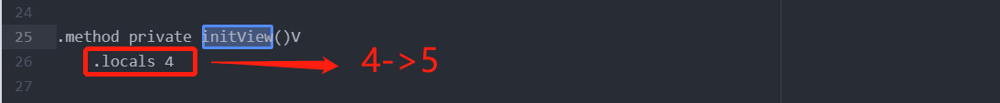

  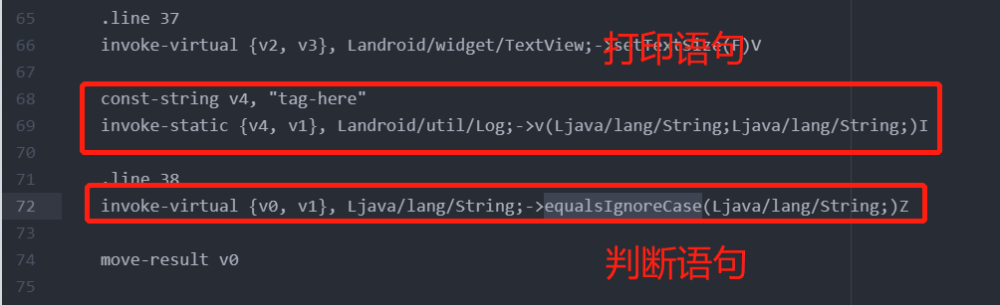

上述2种思路都需要直接修改smali代码，然后对反汇编目录进行**重打包**和**重签名**。

### <span id="033">Part 3 重打包和重签名</span>

* 重打包

  ```bash
  apktool b app-release
  ```

  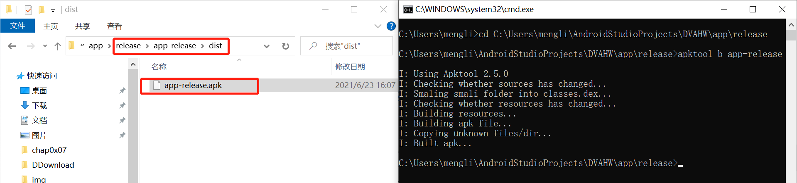

* 重签名

  ```bash
  cd app-release/dist/
  <Android SDK Path>/build-tools/<valid version code>/apksigner sign --min-sdk-version 19 --ks <path to release.keystore.jks> --out app-release-signed.apk app-release.apk
  
  cd app-release/dist/
  C:\Users\mengli\AppData\Local\Android\Sdk\build-tools\30.0.2\apksigner sign --min-sdk-version 19 --ks D:\keystore0622.jks --out app-release-signed.apk app-release.apk
  ```

  没有签名的apk是无法安装的。

  需要注意的是，上述重签名指令中用到的`apksigner`是包含在Android SDK的build-tools子目录下的，Android 7.0开始使用apksigner。7.0之前的版本，使用的Java SDK里的`jarsigner`。签名用到的证书文件，需要预先生成。关于Android APK签名的完整方法，可以参考Anroid开发者官网的[签署您的应用](https://developer.android.com/studio/publish/app-signing.html?hl=zh-cn)。

  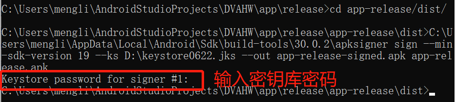

* 这两个命令可以重复执行，会对之前的结果进行覆盖，不用手动删除之前生成的文件。

### <span id="034">Part4 破解效果展示</span>

#### 破解一

录屏：

只要不输入正确的验证码，都能注册成功。

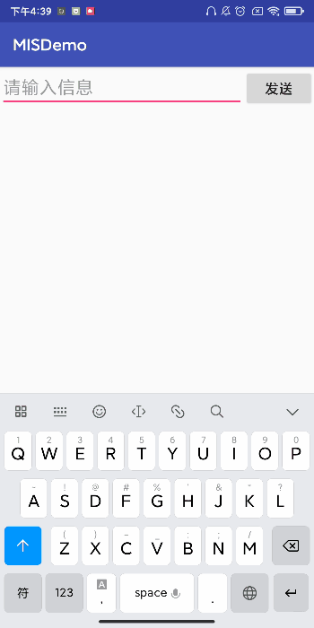

#### 破解二

* 使用`adb install`命令安装apk到模拟器

  ```smali
  adb -s emulator-5554 install C:\Users\mengli\AndroidStudioProjects\DVAHW\app\release\app-release\dist\app-release-signed.apk
  ```

* 安装应用后正常使用app，然后打印日志到txt文件

  ```bash
  adb logcat  ->v2-log.txt
  ```

* 查找`tag-here`，获得正确的验证码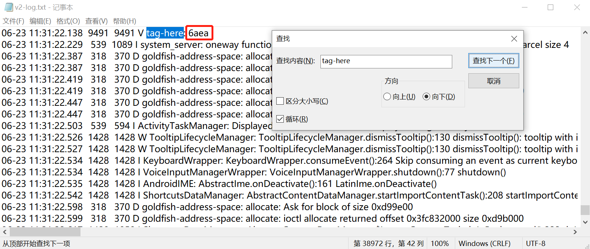

### <span id="035">Part 5 对APK文件进行程序图标替换</span>

* 修改`app-release\res\mipmap-xxhdpi\ic_launcher.png`目录下的图标：

  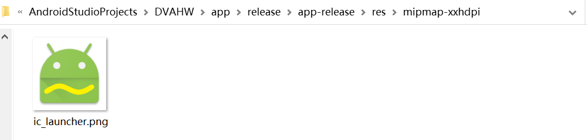

* 重打包、重签名、下载安装，验证修改成功：

  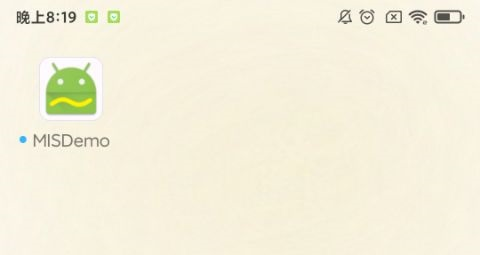

### <span id="036">Part 6 在同一台机器上再次安装重新打包的apk</span>

在同一台机器上再次安装重新打包的apk失败：

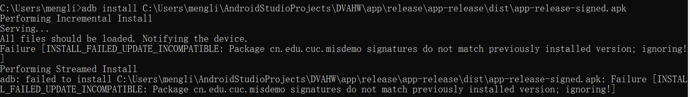

这是因为签名不匹配之前安装的版本，无法安装。卸载旧版再安装新版即可。

## <span id="05">问题和解决</span>

- [x] **Q0：**[Deliberately Vulnerable Android Hello World](https://github.com/c4pr1c3/DVAHW)最新版代码，在Android Studio中导入该项目时报错：

  ```bash
  10:47	Gradle sync failed: This version of the Android Support plugin for IntelliJ IDEA (or Android Studio) cannot open this project, please retry with version 4.2 or newer.
  Consult IDE log for more details (Help | Show Log) (2 m 4 s 968 ms)
  ```

  **A0：**`Android Studio`版本太低，下载最新版`Android Studio 4.2.1`，然后打开项目，待`Android Studio`自动下载一些插件后，项目成功导入。

  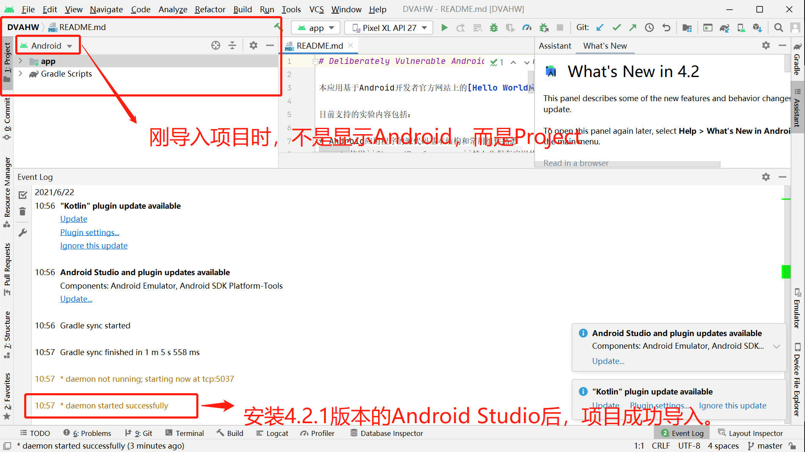

- [x] **Q1：** 创建密钥库和密钥时报错

  `Android studio 警告: PKCS12 密钥库不支持其他存储和密钥口令。正在忽略用户指定的-keypass值`
  
  **A1：** 参考网上博客，在创建时，`key store`和`key`的`Password`必须一致，这可能是因为`keytool`版本的问题，后续可以通过`keytool`命令修改`Password`。
  
  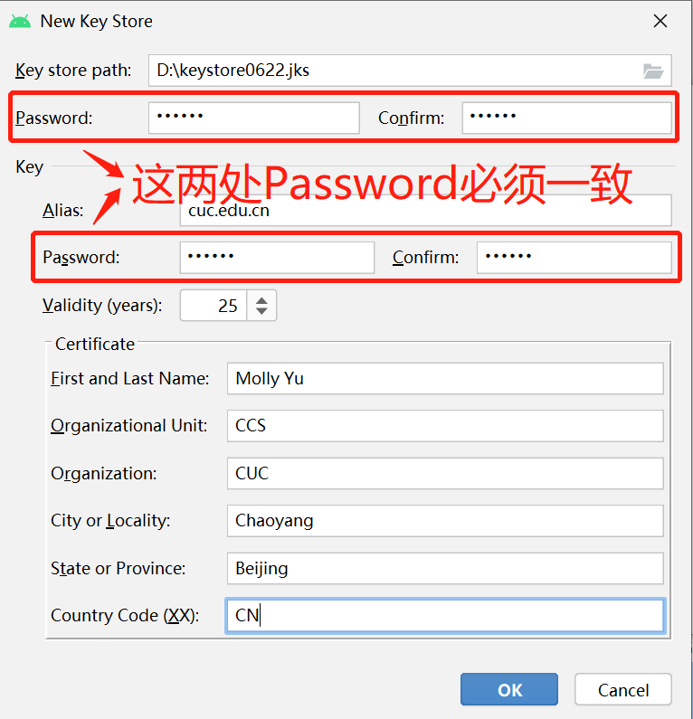
  
  另外不要勾选`Remember Password`，手动输入。
  
  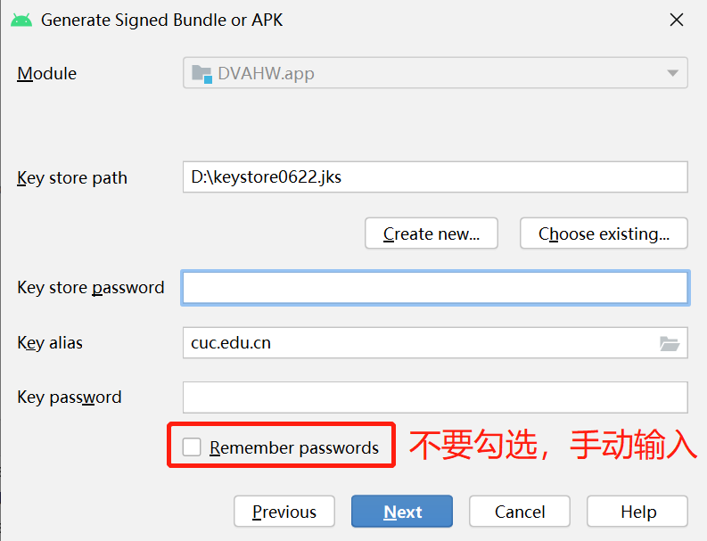
  
- [x] <span id = "QA2">**Q2：** apktool使用报错。</span>

  **A2：** 因为在使用`vscode`的`apklab`时总是出错，所以还是单独安装`apktool`

  ​	①配置`java`环境：[Java 开发环境配置](https://www.runoob.com/java/java-environment-setup.html)

  ​    ②安装`apktool`工具：[Apktool Install Instructions](https://ibotpeaches.github.io/Apktool/install/)

- [x] **Q3：** 关于实验中的第四个要求：

  去掉Hello World v2版程序中DisplayMessageActivity.java代码中的那2行日志打印语句后编译出一个新的apk文件，假设文件名是：misdemo-v3.apk，尝试使用课件中介绍的几种软件逆向分析方法来破解我们的认证算法。

  **A3：** 可以采用[Part2](#032)中的两个逆向分析方法。

## <span id="07">参考资料</span>

* [课本 · 第六章实验 · 移动互联网安全](https://c4pr1c3.github.io/cuc-mis/chap0x06/exp.html)
* [课件 · 第六章  · 移动互联网安全](https://c4pr1c3.github.io/cuc-mis-ppt/chap0x06.md.html)
* [移动互联网安全（2021）_哔哩哔哩 (゜-゜)つロ 干杯~-bilibili](https://www.bilibili.com/video/BV1rr4y1A7nz?from=search&seid=6142859782746666446)
* [android签名jks转pkcs12（JKS 密钥库使用专用格式。建议使用 “keytool -importkeystore xx pkcs12“ 迁移到行业标准格式 PKCS12）_xiaoerye的专栏-CSDN博客](https://blog.csdn.net/xiaoerye/article/details/114284426)


