# H8 Android 缺陷应用漏洞攻击实验

**目录**

* [实验目的](#00)
* [实验环境](#01)
* [实验要求](#02)
* [实验过程](#03)
  * [Part 0 Part 0 实验环境搭建](#030)
  * [Part 1 Developer Backdoor](#031)
  * [Part 2 ](#032)
  * [Part 3 ](#033)
  * [Part 4 ](#034)
  * [Part 5 ](#035)
* [实验总结](#04)
* [问题和解决](#05)
* [课后作业](#06)
* [参考资料](#07)


## <span id="00">实验目的</span>

- 理解 Android 经典的组件安全和数据安全相关代码缺陷原理和漏洞利用方法；
- 掌握 Android 模拟器运行环境搭建和 `ADB` 使用；

## <span id="01">实验环境</span>

- `Windows  10`

- [`Android-InsecureBankv2`](https://github.com/c4pr1c3/Android-InsecureBankv2)

- `python 2.7.18`

- `Android Studio 4.2.1`

- `apktool 5.2.1`

- `AVD`

  

## <span id="02">实验要求</span>

- 详细记录实验环境搭建过程；
- 至少完成以下实验：
  - `Developer Backdoor`
  - `Insecure Logging`
  - `Android Application patching + Weak Auth`
  - `Exploiting Android Broadcast Receivers`
  - `Exploiting Android Content Provider`
- （可选）使用不同于`Walkthroughs`中提供的工具或方法达到相同的漏洞利用攻击效果；
  - 推荐 [drozer](https://github.com/mwrlabs/drozer)

## <span id="03">实验过程</span>

### <span id="030">Part 0 实验环境搭建</span>

```
python2.7 环境
AndroLabServer 服务
InsecureBankv2.apk 应用安装
反汇编
反编译
```

* 首先配置`python 2.7`环境

  * 在[官网](https://www.python.org/downloads/release/python-2718/)下载[python2.7.18](https://www.python.org/ftp/python/2.7.18/python-2.7.18.msi)并安装（一路`next`即可）

  * 添加环境变量`path`：`C:\Python27;C:\Python27\Scripts;`，并将这两条移动到最上面，然后在命令行使用`python`和`pip`命令时默认是`2.7`版本。

    

* 下载最新仓库到本地

  ```bash
  git clone https://github.com/c4pr1c3/Android-InsecureBankv2.git
  ```

* 安装必备软件

  ```python
  pip install install -r requirements.txt
  ```

* 运行 HTTP 服务器

  ```python 
  # 确保你已经安装了 python2。然后将当前目录更改为 AndroLabServer 文件夹
  # cd AndroLabServer
  
  python app.py
  ```

  

  `AndroLabServer`成功启动，也说明环境配置成功

* 查看可选参数

  ```python
  python app.py --help
  # InsecureBankv2 Backend-Server
  # Options:
  #   --host h    serve on host h (default 192.168.58.1)
  #   --port p    serve on port p (default 8888)
  #   --help      print this message
  ```

* 安装 `InsecureBankv2.apk` 到 `AVD`

  ```bash
  # 确保当前目录：...\Android-InsecureBankv2
  # 确保 avd已经启动
  
  adb install InsecureBankv2.apk
  ```

  

  安装成功

* 使用`...\Android-InsecureBankv2\Usage Guide.pdf`中的用户名密码测试登录

  ```bash
  User: dinesh 
  Password: Dinesh@123$ 
  User: jack 
  Password: Jack@123$
  ```

  

  登录成功

* `apktool`反汇编`InsecureBankv2.apk`

  ```bash
  # apktool 安装见第七章实验
  
  apktool d InsecureBankv2.apk -o InsecureBankv20
  # -o <dir> 指定反汇编结果保存文件夹，默认为[ApkName]
  ```

  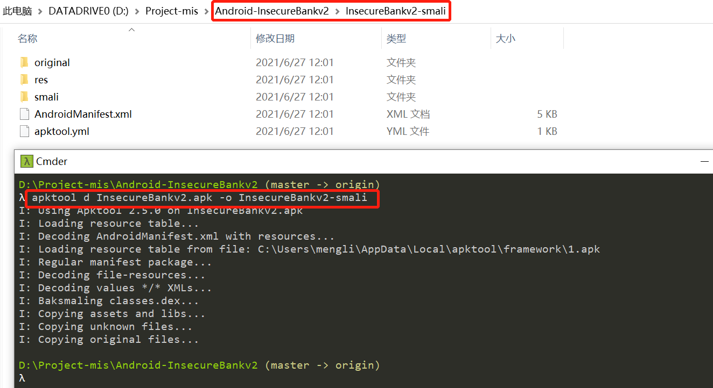

  反汇编成功
  
* `Jadx`反编译`InsecureBankv2.apk`

  * 安装`Jadx`

    ```bash
    # 由于上一个实验没有安装Jadx环境，所以先安装
    git clone https://github.com/skylot/jadx.git
    cd jadx
    gradlew.bat dist
    ```

    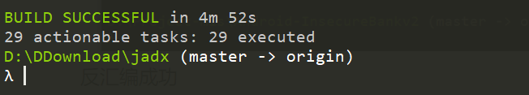

  * 反编译

    安装成功后可以使用`jdax-gui-dev.exe`打开`jdk`进行反编译

    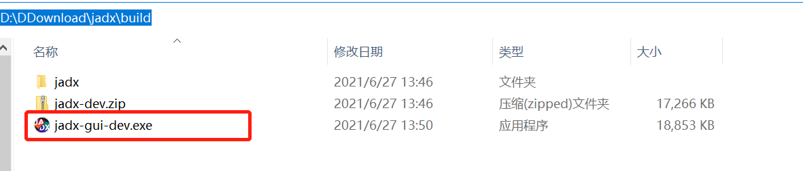

    如下图，左边为反编译结果，右边为仓库里的源代码，反编译结果和源代码有细微差别，但代码逻辑都一致

    

    反编译成功

### <span id="031">Part 1`Developer Backdoor`</span>

#### 1.0 配置

* Android-InsecureBankv2 apk ——已经在`Part 0`中下载完成
*  JADX ——已经在`Part 0`中下载安装
* dex2jar——点击下载[当前最新版](https://sourceforge.net/projects/dex2jar/files/dex2jar-2.0.zip/download)到本地解压缩即可

#### 1.1 步骤

1. 解压缩`InsecureBankv2.apk`，直接`右键使用7zip解压缩`

   

2. 复制`classes.dex`文件到`dex2jar`目录下

   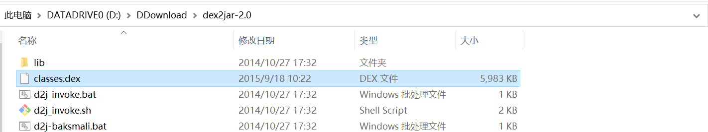

   

3. 使用下面的命令将dex文件转换为jar文件

   ```bash
   d2j-dex2jar.bat classes.dex
   ```

   注意：本实验是在`windows`系统下操作，然而实验指南是`ubuntu`系统。`windows`系统下执行`.bat`文件而不是`.sh`文件。

   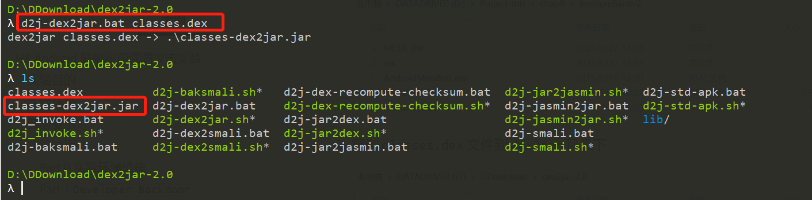

   生成的`jar`文件为：`classes-dex2jar.jar`

4. 使用`JADX-GUI`打开`classes-dex2jar.jar`文件

   进入目录：`...jadx\build\jadx\bin\`，双击`jadx-gui.bat`，选择`classes-dex2jar.jar`文件：

   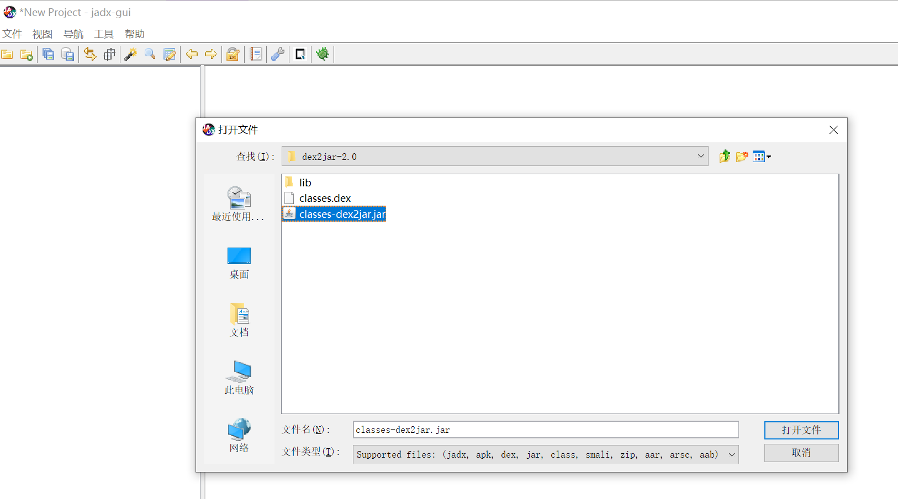

   或者使用命令打开：

   ```bash
   jadx-gui.bat <path to classes-dex2jar.jar>
   ```

5. 下面的屏幕截图显示了Android-InsecureBankv2应用程序中开发人员后门的反编译代码，允许用户名为“devadmin”的用户与其他所有用户相比到达不同的端点。

   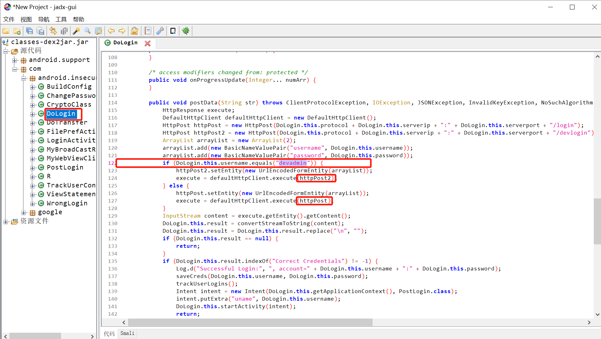

6. 进行测试：

   

   我们发现，任何用户都可以使用用户名“devadmin”，并使用任何密码登录应用程序，而不管密码是否有效。

#### 1.2 小结

开发者在开发应用的时候留了后门，如果知道了后门，非常容易绕过验证破解成功。


### <span id="032">Part 2 `Insecure Logging`</span>

#### 2.0 配置

* Android-InsecureBankv2 apk ——已经在`Part 0`中下载完成
* Android SDK——已在第五章实验中下载完成

#### 2.1 步骤

1. 将` InsecureBankv2.apk`文件复制到`Android SDK`的`platform-tools`文件夹中，然后使用`adb install  InsecureBankv2.apk`

   在`Part 0`中已经安装成功，可以直接使用，也可以卸载重装

2. 在命令行使用`adb logcat`查看日志

   直接输出在命令行不好分析。将输出到txt文件中，使用`ctrl+c`结束打印日志

   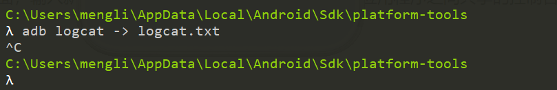

3. 在模拟器上启动已安装的`InsecureBankv2`应用程序

4. 输入有效的凭据并点击`Login`

   ```
   User: dinesh
   Password: Dinesh@123$
   ```

   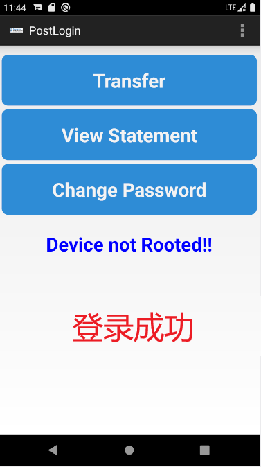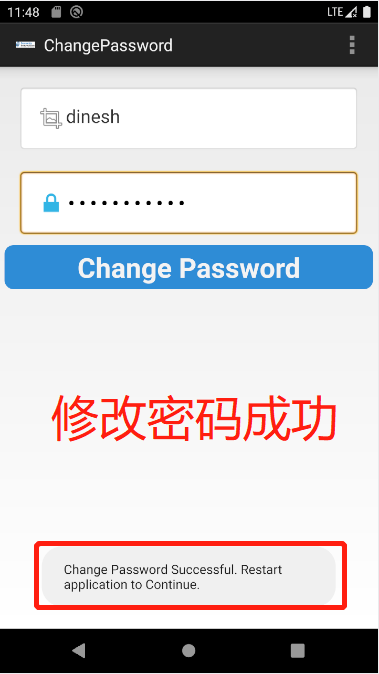

   下面的屏幕截图显示了日志里记录的凭据：

   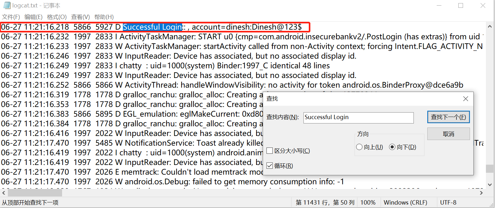

5. 进入“更改密码”页面，输入新的凭据

   ```
   修改密钥为：Dinesh@321$
   ```

   下面的屏幕截图显示了在日志里记录的新凭据：

   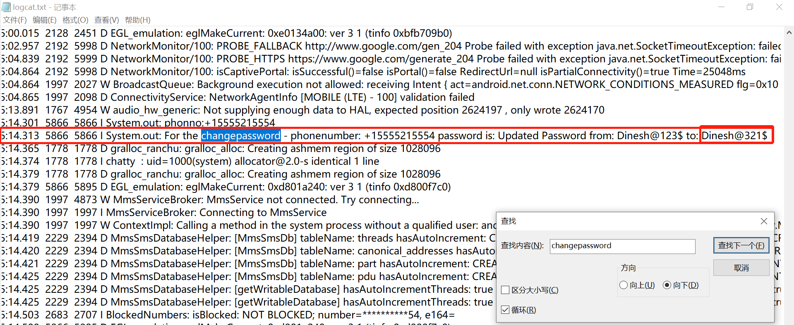

#### 2.2 小结

应用程序将用户的输入明文记录在日志中，如果被窃取到用户日志，即可获得登录过的账户和密钥。


### <span id="033">Part 3 `Android Application patching + Weak Auth`</span>

#### 3.0 配置


#### 3.1 步骤

#### 3.2 小结

### <span id="034">Part 4 `Exploiting Android Broadcast Receivers`</span>

#### 4.0 配置

#### 4.1 步骤

#### 4.2 小结

### <span id="035">Part 5 `Exploiting Android Content Provider`</span>

#### 5.0 配置

#### 5.1 步骤

#### 5.2 小结


## <span id="04">实验总结</span>

## <span id="05">问题和解决</span>

- [x] **Q0：** `sh d2j-dex2jar.sh classes.dex`命令执行失败

  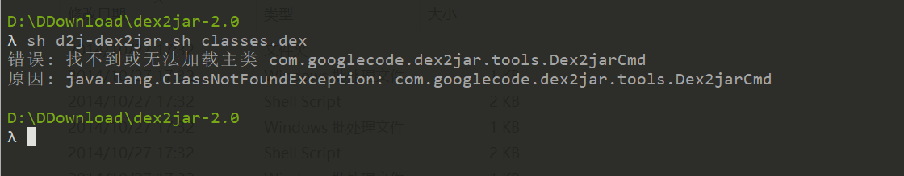

  **A0：**在windows系统下要执行`.bat`命令：`d2j-dex2jar.bat classes.dex`

- [x] **Q1：** `mp4`转`gif`失败，原始工具不好用了。

  **A1：**发现新的录屏和`GIF`制作软件[ScreenToGif](https://www.screentogif.com/)，非常好用。另外`腾讯QQ`自带的录屏功能也很好用。

## <span id="06">课后作业</span>

## <span id="07">参考资料</span>

* [课本 · 第八章实验 · 移动互联网安全](https://c4pr1c3.github.io/cuc-mis/chap0x08/exp.html)
* [课件 · 第八章  · 移动互联网安全](https://c4pr1c3.github.io/cuc-mis-ppt/chap0x08.md.html)
* [移动互联网安全（2021）_哔哩哔哩 (゜-゜)つロ 干杯~-bilibili](https://www.bilibili.com/video/BV1rr4y1A7nz?from=search&seid=6142859782746666446)
* []()
* []()
* []()


