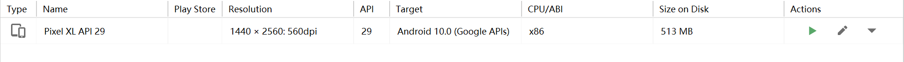
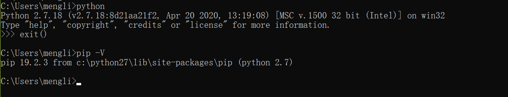
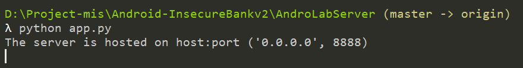
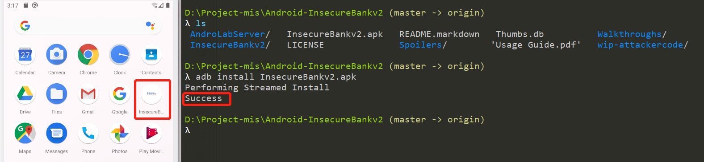
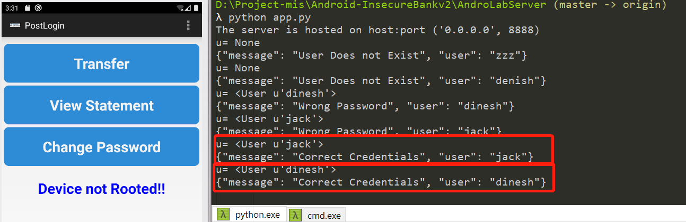
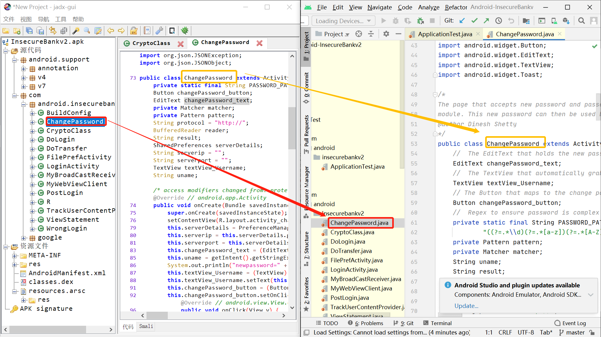

# H8 Android 缺陷应用漏洞攻击实验

**目录**

* [实验目的](#00)
* [实验环境](#01)
* [实验要求](#02)
* [实验过程](#03)
  * [Part 0 Part 0 实验环境搭建](#030)
  * [Part 1 ](#031)
  * [Part 3 ](#032)
* [实验总结](#04)
* [问题和解决](#05)
* [课后作业](#06)
* [参考资料](#07)


## <span id="00">实验目的</span>

- 理解 Android 经典的组件安全和数据安全相关代码缺陷原理和漏洞利用方法；
- 掌握 Android 模拟器运行环境搭建和 `ADB` 使用；

## <span id="01">实验环境</span>

- `Windows  10`

- [`Android-InsecureBankv2`](https://github.com/c4pr1c3/Android-InsecureBankv2)

- `python 2.7.18`

- `Android Studio 4.2.1`

- `apktool 5.2.1`

- `AVD`

  

## <span id="02">实验要求</span>

- 详细记录实验环境搭建过程；
- 至少完成以下实验：
  - `Developer Backdoor`
  - `Insecure Logging`
  - `Android Application patching + Weak Auth`
  - `Exploiting Android Broadcast Receivers`
  - `Exploiting Android Content Provider`
- （可选）使用不同于`Walkthroughs`中提供的工具或方法达到相同的漏洞利用攻击效果；
  - 推荐 [drozer](https://github.com/mwrlabs/drozer)

## <span id="03">实验过程</span>

### <span id="030">Part 0 实验环境搭建</span>

```
python2.7 环境
AndroLabServer 服务
InsecureBankv2.apk 应用安装
```

* 首先配置`python 2.7`环境

  * 在[官网](https://www.python.org/downloads/release/python-2718/)下载[python2.7.18](https://www.python.org/ftp/python/2.7.18/python-2.7.18.msi)并安装（一路`next`即可）

  * 添加环境变量`path`：`C:\Python27;C:\Python27\Scripts;`，并将这两条移动到最上面，然后在命令行使用`python`和`pip`命令时默认是`2.7`版本。

    

* 下载最新仓库到本地

  ```bash
  git clone https://github.com/c4pr1c3/Android-InsecureBankv2.git
  ```

* 安装必备软件

  ```python
  pip install install -r requirements.txt
  ```

* 运行 HTTP 服务器

  ```python 
  # 确保你已经安装了 python2。然后将当前目录更改为 AndroLabServer 文件夹
  # cd AndroLabServer
  
  python app.py
  ```

  

  `AndroLabServer`成功启动，也说明环境配置成功

* 查看可选参数

  ```python
  python app.py --help
  # InsecureBankv2 Backend-Server
  # Options:
  #   --host h    serve on host h (default 192.168.58.1)
  #   --port p    serve on port p (default 8888)
  #   --help      print this message
  ```

* 安装 `InsecureBankv2.apk` 到 `AVD`

  ```bash
  # 确保当前目录：...\Android-InsecureBankv2
  # 确保 avd已经启动
  
  adb install InsecureBankv2.apk
  ```

  

  安装成功

* 使用`...\Android-InsecureBankv2\Usage Guide.pdf`中的用户名密码测试登录

  ```bash
  User: dinesh 
  Password: Dinesh@123$ 
  User: jack 
  Password: Jack@123$
  ```

  

  登录成功

* 反编译`InsecureBankv2.apk`

  ```bash
  # apktool 安装见第七章实验
  
  apktool d InsecureBankv2.apk -o InsecureBankv2-smali
  # -o <dir> 指定路径，默认路径为InsecureBankv2
  ```

  

  反编译成功

### <span id="031">Part 1 </span>

### <span id="032">Part 2</span>

## <span id="04">实验总结</span>

## <span id="05">问题和解决</span>

- [ ] **Q0：**

  **A0：**

- [ ] **Q1：**

  **A1：**

## <span id="06">课后作业</span>

## <span id="07">参考资料</span>

* [课本 · 第八章实验 · 移动互联网安全](https://c4pr1c3.github.io/cuc-mis/chap0x08/exp.html)
* [课件 · 第八章  · 移动互联网安全](https://c4pr1c3.github.io/cuc-mis-ppt/chap0x08.md.html)
* [移动互联网安全（2021）_哔哩哔哩 (゜-゜)つロ 干杯~-bilibili](https://www.bilibili.com/video/BV1rr4y1A7nz?from=search&seid=6142859782746666446)
* []()
* []()
* []()


